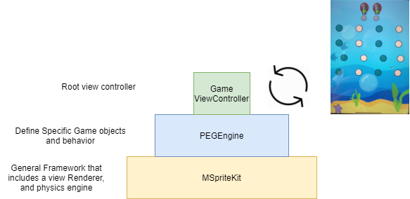
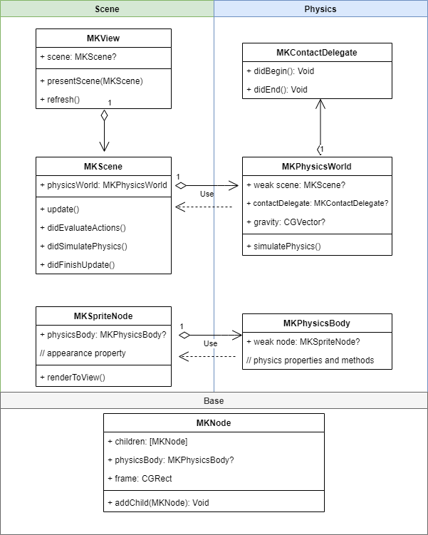
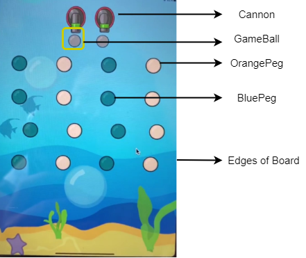

After 2 weeks, I present the developer guide for MSpriteKit and how it relates to the Game Engine for Peggle 2.0 - PEGEngine.

---

## #1 Architecture

### General

The 3 main components of the Peggle2.0Game are:

- _MSpriteKit_: Foundation, supplying the Physics Engine, Scene builders and View Renderer
- _PEGEngine_: A Peggle2.0 specific engine which specifies the appearance and behaviors of game objects
- _GameViewContoller_: The root view controller of the app, which setups a pre-loaded `Board` into the View, and start the Game Loop running.


_Figure 1: Relationship between MSpriteKit, PEGEngine and GameController_

### MSpriteKit

MSpriteKit strives to be a general-purpose framework for drawing edges, and volume based nodes in two dimensions. It includes an in-built view renderer, while offering a simple programming interface to make it easy to create games and other graphics-intensive apps. Equipped with a set of animations and physics behaviors, you can quickly add life to your visual elements.

MSpriteKit, like the original SpriteKit by Apple, is split into 3 distinct components:

- Base: `MKNode` is the base class of all MSpriteKit nodes.

- Scene Building and View Renderer: Display visual content using MSpriteKit.

  - `MKView`: MSpriteKit's inbuilt view renderer, equipped with a game loop to refresh the view per frame.
  - `MKScene`: An object that organizes all of the active MSpriteKit content.
  - `MKSpriteNode`, `MKEdgeNode`: Onscreen graphical elements that can be initialized from an image, a solid color or as an edge.

- Physics Simulation: Add physics behaviors to nodes in your scene.

  - `MKPhysicsWorld`: The driver of the physics engine in a scene; it exposes the ability for you to configure and query the physics system.
  - `MKPhysicsBody`: An object that adds physics simulation to a node.
  - `MKPhysicsContact`: A description of the contact between two physics bodies.
  - protocol `MKPhysicsContactDelegate`: Methods your app can implement to respond when physics bodies come into contact.


_Figure 2: General Architecture of MSpriteKit (more on specific classes in Section 2&3)_

### PEGEngine

A game engine built on top of MSpriteKit specifically made for a remade Peggle 2.0. The game engine encapsulates the game objects and their behaviors when interacting with other game objects.


_Figure 3: General Architecture of PEGEngine_


_Figure 4: Game Objects Classes using in PEGEngine_

## #2 Scene Building and View Rendering (MSpriteKit)

### 2a Rendering the View from Scene

#### Game Loop

The game loop is implemented using `CADisplayLink` class from UIKit. Every frame, the `step` function is called:
`

```swift
/// Functions to be performed with each frame
@objc func step(displayLink: CADisplayLink) {
  // Calulate change in time `dt` between previous frame and current frame
  let dt = ...

  scene.update(dt: dt)

  // Refresh the view
  refresh()
}
```

#### MKView `refresh()`

- var `animatingNodes`: nodes that will be undergoing animation
- var `fixedNodes`: nodes that will never change their position or view

```swift
/// Refresh the view every frame
func refresh() {
  // Perform animation and additionlly a callback function upon completion
  animateNodes(nodes: animatingNodes)

  removeNonAnimatingNonFixedViews()

  addNonAnimatingNonFixedSpriteNodes(nodes: self.scene!.children)
}
```

### 2b Updating the Scene

The scene update lifecycle methods can be overriden by subclasses.

```swift
/// Tells your app to perform any app-specific logic to update your scene.
func update(dt: TimeInterval) {
  didEvaluateActions()

  physicsWorld.simulatePhysics(dt: dt)

  didSimulatePhysics()

  didFinishUpdate()
}
```

## #3 Physics (MSpriteKit)

### 3a simulatePhysics()`

```swift
/// Simulate physics and updates position and velocity of nodes
func simulatePhysics(dt: TimeInterval) {

  let newPositions = generateNewPositions(dt: dt)

  // Collision: where that happens, resolve collision by adjusting
  // the position to the point of collision
  resolveCollisions(newPositions: newPositions)

  updateScene(newPositions: newPositions)

  updateVelocityOfNodes(dt: dt)
}
```

Figure 4: Resolving collisions

## #4 Design Considerations

### 4a Updating views

### 4b Subclassing Game Objects

### 4c Handling View Animations

## References

[more about peggle](https://cs3217.netlify.com/docs/problem-sets/problem-set-2)

[spritekit](https://developer.apple.com/documentation/spritekit)

[swift docs](https://swift.org/documentation/)
