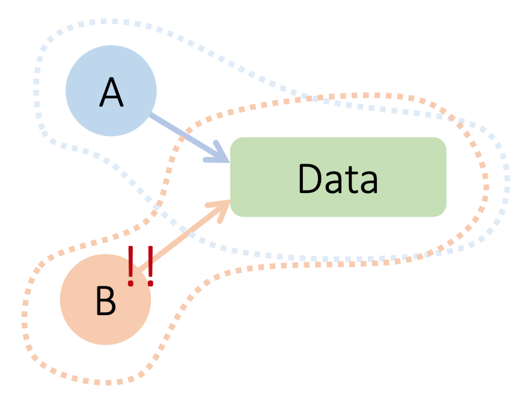

I've been coding in swift almost daily for the past 4 weeks, and will be continuing at least for the next 3 months. Today, I've decided to take the first step in what some call *learning through reflection*.

The first Swift app I've been making is a re-creation of the popular Peggle Game. Part 2 of this series will be addressing some thoughts (and also hindsight) I have while designing the Level Designer of Peggle. Hopefully, this documentation of my journey will help some of you readers, or at least my future self. 

___

## What is Peggle? 

Please refer to the reference for more info. In this series, I'd be describing certain design choices I had for my remake of the game, Peggle2.0.

## # 1 Design of the Peg Model

In the first version of Peggle2.0, there are 2 types of pegs: Orange and Blue (you can imagine that in a future extension, there could be an arbitrary number of pegs of different type, and even different functions). 

Minimal differences between orange peg and blue peg: 
- Different image file paths (`PegView` extends Swift's `UIImage`)
- Different behaviors (similar to the original Peggle game, the aim is to clear all orange pegs - blue pegs are just a "distraction")


The choice of design that came to my mind immediately is: 

### Choice 1: Using an enum `PegType` to differentiate between types.

```swift
struct Peg {
    var color: PegType
    ...
}

enum PegType {
    case blue
    case orange

    var imagePath = {
        // switch case
    }
}


class someViewController: UiViewController {

    // to declare the different pegs
    let orangePeg = Peg(color: .orange, ...)
    let bluePeg = Peg(color: .blue, ...)

}
```

As the number of arbitrary pegs to be added increased, the cons of this design becomes apparent. 

1. The list of cases in `PegType` will grow, so will the switch cases.
2. This solution doesn't yet address the fact that different Pegs might have different behaviors. 

### Choice 2: Polymorphism using class inheritence

Coming from a Java background, when it comes to **Point 2**, polymorphism instantly comes to mind - i.e. using inheritence. We can easily implement this by converting `Peg` struct into a class, and extend it to create new peg variants: 

```swift
class Peg {
    var center: CGPoint
    var size: CGSize
    ...

    func commonFunction() { ... } 
}

class BluePeg: Peg {
    ...
    func addedProperty() { ... }
}

class OrangePeg: Peg {
    ...
    func addedProperty() { ... }
}
```

Is this it? is inheritence enough (or rather a better way)? 

### Choice 3: Protocol-oriented programming?

After watching WWDC talk on Protocol-oriented programming in Swift [2], I'm convinced there must be a better way than subclassing the pegs for three reasons. Here I'll summarise the 3 points I've gathered about classes in the talk for the benefit for the general reader: 

#### 1. Intrusive Inheritence

* Superclass stored properties
    * must be inherited
    * must be initialised
    * without breaking invariants

* What/how to override or when not to?

An example on how Design 2 may break due to **Intrusive Inheritence** is if we decide to create a peg that has a *fixed size*, but the Peg class we extend from has already initialised size to be a internal variable. Or what if we decide to override a function of the base class `Peg` which might break some invariant?

#### 2. Implicit Sharing

Simply put: 

- A hands B some data ‒ But still holds a reference to the data
- If A mutates the data ‒ B is caught off-guard



However, this doesn't really pose a problem for our `Peg` model as there is no reason we would wanna keep 2 different copies of the same `Peg` (as each `Peg` model should correspond to a `PegView` on the screen).

#### 3. Lost Type Relationships

What are lost type relationships? Suppose we want to implement a function `compare` for all pegs which count the compare the number of times a peg is touched by the ball. 

Suppose somewhere in the future, we decided to implement a subclass `bouncePeg` where we compare the number of bounce touch instead (a bounce touch is a touch which bounce on at least 1 surface before touching). 

```swift
class Peg {
    var numOfTouches: Int = 0

    func compare(other: Peg) -> Bool {
        return numOfTouches < other.numOfTouches 
    }

}

class BouncePeg: Peg {
    ...
    var numOfBounces: Int = 0

    override func compare(other: Peg) -> Bool {
        // Forced downcast!
        return numOfBounces < (other as! BouncePeg).numOfBounces 
    }
}
```

As evident above, the overriden method in `BouncePeg` has to include a force downcast to ensure that `other.numOfBounces` exists. Having to use a force downcast is generally a form of Code Smell. Of course, we could have guarded hat `other` is an instance of `BouncePeg` before downcasting. Still is there a cleaner way we could have avoided this?

Here, comes the Aha moment: **"Start with a Protocol before writing a class"**. 

```swift
protocol Peg {
    // Notice the use of Self
    func compare(other: Self) -> Bool
}

// we use struct here as we don't specifically need to use 
// a class here
// we could also avoid the problems described of using a class
struct BouncePeg {
    ...
    var numOfBounces: Int = 0

    override func compare(other: BouncePeg) -> Bool {
        return numOfBounces < other.numOfBounces 
    }
}
```

*Sweet!* Look how easy protocol solves the problem of Lost Type Relationships (or do they really ???) 

Oh wait, there's a catch to this: with the use of `Self`, `Peg` can no longer be used as a type, but only as a generic constraint. Consider if we have a board, and we want a functionto add pegs to the board:

```swift

// error
struct Board {

    // error: Peg cannot be used as a type
    // as this leads to heterogenous array (allow different variants of pegs)
    // which cannot work with Self
    func addPegs(pegs: [Peg]) { 
        ...
    }

}

// correct
struct Board {

    // Peg here is used as a generic constraint
    func addPegs<T: Peg>(pegs: [T]) { // homogenous array (only 1 type)
        ...
    }

}

```

This is a pretty bad restriction for `Peg` because we would expect to add different `Pegs` into the same Board (using the same function - there is no need to differentiate adding different variant of `Peg`s). Here, using `Self` might not be such a good idea after all.

#### My Conclusion

Protocol-oriented programming is really interesting, offering many features such as using `Self` to increase customisability of classes. However, I feel that the usual OOP (Polymorphism) may also be useful depending on the engineering problem you are facing. For the Design of Peg Model, I have decided for now that **Choice 2** suits the problem statement more.

___
---

Hope you've enjoyed this article. Do keep an eye out for Coding With Swift Series 2.2/5 soon. It will be about another design dilemma for the Level Designer. :)

~ Melodies

---

### After words

 Some of you curious ones might wonder why start from Part 2? At this point in writing I've just finalised my Level Designer (first draft version) and am  planning to make some design refinement (as I'll be describing) after listening to a talk on Protocol-oriented programming. Writing about this in Part 2 will be fresh especially at this time when I'm comtemplating between designs. The overall plan is to complete the app (as well as the remaining Parts 3-5 of this series) before returning to Part 1: Lessons about swift I've learnt, collating the various aspects of Swift programming I've gathered. 


### References

[1] [More about Peggle and the re-maded Level Designer](https://cs3217.netlify.com/docs/problem-sets/problem-set-2)

[2] [Protocol-oriented programming Apple WWDC 2015](https://developer.apple.com/videos/play/wwdc2015/408/)

[3] [Swift Docs](https://swift.org/documentation/)