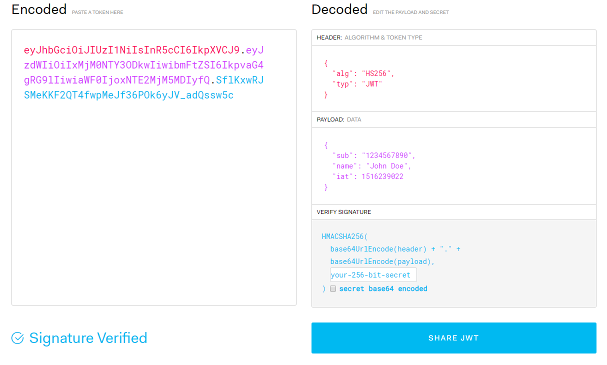

As long as passwords still exist, password reset is one must-have feature that greatly improves user experience. 
This article aims to give a high-level overview of implementing password reset flow using 
[JSON Web Tokens (JWT)](https://jwt.io/). 
     
### From a User's Perspective
A typical password reset flow consists of 3 simple steps for the **user**:

1. User requests for password reset through the app
2. User receives an email of the password reset link
3. User clicks on the link and is directed to a page to enter a new password

***Click on the image to zoom in***

### From a Developer's Perspective

#### Security Challenges
There exist a few security challenges to implementing the flow above: 
- How can we create a unique link for each user such that **malicious attackers cannot reset 
other users' passwords** other than their own?

- How can we **prevent a user from re-using the same link** to reset password? (A problem arising from this is: 
once the link is compromised, an attacker can use the link to reset the user's password unlimited number of times.)

In response to these challenges, our reset password link has to be: 
- Valid for only 1 reset password attempt
- Valid for a limited time
- Unique and difficult for attackers to guess

#### JWT as a Solution

[JSON Web Tokens (JWT)](https://jwt.io/) has been a popular way to verify authorization on the web and we will use it
for an implementation of the reset password flow. Before we delve deeper, what are JWT? 

In its compact form, JSON Web Tokens consist of three parts separated by dots (.), which are:

- Header: Contains metadata such as the signing algorithm used for the signature (e.g. HMAC SHA256 or RSA)

- Payload: Contains public claims/information such as username. Also contains predefined and recommended claims
such as exp (expiration time) and sub (subject).

- Signature: To create the signature, you have to take the encoded header, the encoded payload, a secret, 
the algorithm specified in the header, and sign all of these. 

Only someone who knows the secret can generate the same signature. 
i.e. JWT proves authorization by proving knowledge of the secret.

**Note!!!** The information carried by a JWT is **PUBLIC** and visible to all. Sensitive details like password
such not be placed inside the JWT Payload.

Below is an example of a JWT and the decoded information it carries: 

***Click on the image to zoom in***

### Reset Password Flow Under The Hood
To summarise, I present to you a possible implementation of the Reset Password Flow using JWT:
1. User requests for password reset
2. UI sends POST request to servers to **generate a JWT** in the form of a link sent to the user through email

-- The JWT payload consists of the username to uniquely identify the user. JWT expiration is set to a limited time say 30mins.

-- The JWT signature is signed with a secret: the user's password hash (not known to public)

-- The JWT could be appended in the query of the link: https://exampletest.com/reset/password?token={Insert JWT here}

3. The user clicks on the reset password link and redirected to a page

4. The front-end sends the JWT parsed from the querystring to the backend to **Verify the JWT** using the 
user's password hash (user is identified using the username in JWT payload).

5. If there is no error, the user is presented with a Reset Password Form. Else, an error should be shown.

***Click on the image to zoom in***

#### How does this Implementation Solve Our Security Challenges?
1. Using the password hash as a secret for signing the JWT means that after changing the password, the signature of 
the link will no longer be valid -- since the password hash has changed! 

This means that the user is only allowed to change the password once and the link sent becomes invalid.

*Voila*

---

##### *Disclaimer:*
User and Develop's POV diagrams are self-made. Other images used to make the diagrams and screenshots do not belong to me.

