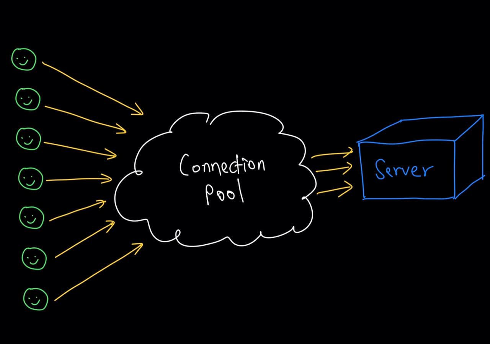
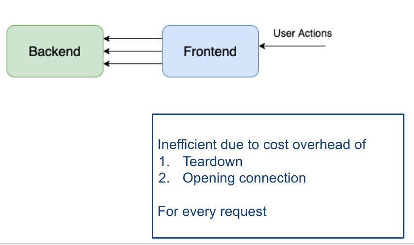
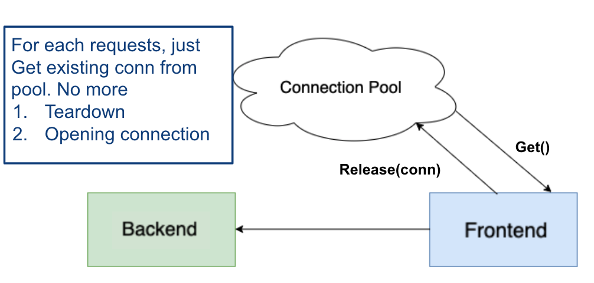

# Introduction

Connections are everywhere! To communicate between 2 parties, we need connections. We use them in modern web stack and apps: from server-client to server-database interactions. But why don't we hear about it often?
Abstraction! Details on connections are often abstracted away (and for good reason!). However, if you are planning to build your own program with great performance, a firm understanding of what goes under the hood is definitely an advantage!

In this article, I will be starting off with a common problem to motivate the use of connection pooling. I will then share 3 important tips for building an efficient connection pool, ending off with an example to tie it all together.

<em>P.S. The code examples are written in Golang which is awesome.</em><br>

# The Problem
Let's consider a typical web scenario when we have 2 servers, a frontend, and a backend communicating. Note that this example can be extended to other forms of connections.

Each time the Frontend wants to communicate with Backend, it opens a new connection. When Frontend is done, it closes the connection. Imagine if we have 1000 requests per second, this would mean opening and closing 1000 connections every second! This is very <strong>inefficient</strong>!


But do we need to close the connections every time? Probably not. A better option here would be to <strong>reuse</strong> them. Here is when connection pooling comes to save the day!

# Connection pooling: Save cost by reusing!
A connection pool keeps idle connections alive (instead of closing them). When the Frontend needs a connection, it calls a Get() function to get an existing connection from the pool instead of opening a new one. Once the communication is done, Frontend can release the connection back into the pool for reuse.

No more opening and closing connections with every request!


This sounds great! So how do we implement a connection pool?

# MOT: Three concepts to keep in mind when building your own connection pool
## 1. Methods:
There are 4 main methods to implement in the Connection Pool:

```go
type ConnectionPool interface {
	// This gets an active connection from the connection pool if exists,
        // else create a new connection. 
	Get() (net.Conn, error)

	// This releases an active connection back to the connection pool.
	Release(conn net.Conn) error

	// This discards an active connection from the connection pool and
        // closes the connection.
	Discard(conn net.Conn) error

        // Enter the connection pool into a state of inactive. All active
        // connections in the pool will be closed. In the inactive state,
        // the pool will no longer return connections when Get() is called 
        // and Release(conn) will close the conn instead. 
	EnterInactiveState()
}
```

To simplify things, the connection in the example is a net.Conn which is a stream-oriented network connection from Golang standard net library. In general, it is recommended to create a wrapper around your connections.
See examples of how to implement these methods in the Connection pool libraries in Golang section.

## 2. Options
Not all connection pools should be configured the same way — applications have different load patterns and hence render different settings to optimize their performance.


Here are some possible options that you can include to make your connection pool more versatile to different use cases:

<strong>MaxIdleConnections</strong>
> The maximum number of idle connections per address that are kept alive by the connection pool.

Consider the expected traffic rates and latency while setting this parameter. MaxIdleConnections should be set higher than peak parallel requests.

Related parameter: <em>MaxIdleTime</em>

<strong>MaxIdleTime</strong>
> The maximum amount of time an idle connection can stay alive. If not specified, connection stays active until discarded or when the pool enters inactive state.

<strong>MaxActiveConnections</strong>
> The maximum number of connections that can be active per address at any given time.

When the server faces some transient performance issue such as a temporary increase in latency, more connections will be created, which in turn aggravates the situation. MaxActiveConnections ameliorates this by imposing a cap on the number of connections created.

Related parameters: <em>IsWait, WaitTime</em>

<strong>IsWait</strong>
> A boolean flag indicating pool's response when connections equal to MaxActiveConnections.
> When set to true, calling Get() waits until the number of connections fall below MaxActiveConnections before returning an active connection. When set to false, return nil (or error) without waiting.

<strong>WaitTime</strong>
> Indicates how long to wait for number of connections to fall below MaxActiveConnections before returning nil (or error).

## 3. Thread Safe 
Our connection pool implementation also has to be thread-safe to protect against race conditions resulted from concurrent requests.
We can achieve thread-safe by using mutex or in the case of Go, buffered channels. Refer to Connection pool libraries in Golang section for more examples on how to implement this.

# Still curious? More details and examples
## When to reuse and when to discard connections
It is important to make sure that the connections we release back into the pool are not corrupted.

To do so, we can add a simple function on the Receiver Server side to determine if the connection is reusable. If the connection is reusable, release it back to the pool, else discard it instead.

```go
// condRelease releases this connection if the error pointed to by err
// is nil (not an error) or is predefined Reusable error
// The purpose is to not recycle TCP connections that are bad.
func (cn *conn) ConnRelease(err *error) {
	if *err == nil || resumableError(*err) {
		cn.release()
	} else {
		cn.nc.Close()
	}
}

func resumableError(err error) bool {
	switch err {
	case ReusableError:
		return true
	}
	return false
}
```

## Changes to server behavior with connection pooling
Note that we should initialize the connection pool only in the Sender server. Both servers should not manually close or open new connections, and leave this to the Connection Pool instead. Instead, both servers should access the exposed connection pool methods to Get, Release, or Discard connections.

## Connection pool libraries in Golang
The best way to implement your own connection pool is to study how others have done it! Here are some popular libraries in Golang:

1. https://github.com/fatih/pool
2. https://github.com/dropbox/godropbox/tree/master/resource_pool


---

Check out post here on Medium! [https://melodiessim98.medium.com/connection-pooling-3-things-you-need-to-know-to-build-a-connection-pool-from-scratch-9d9d4d5ff396](https://melodiessim98.medium.com/connection-pooling-3-things-you-need-to-know-to-build-a-connection-pool-from-scratch-9d9d4d5ff396)
