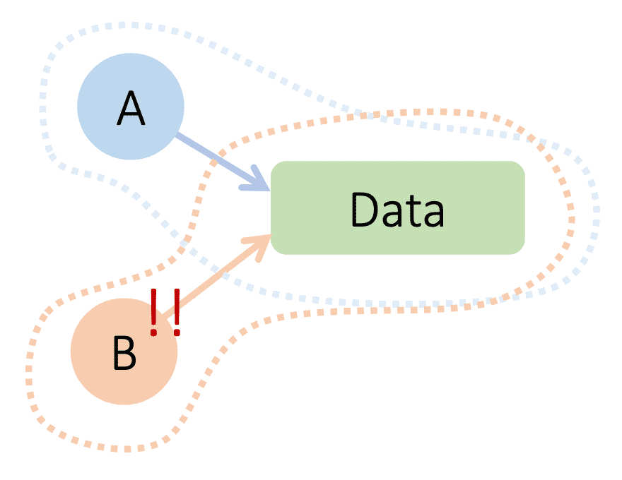
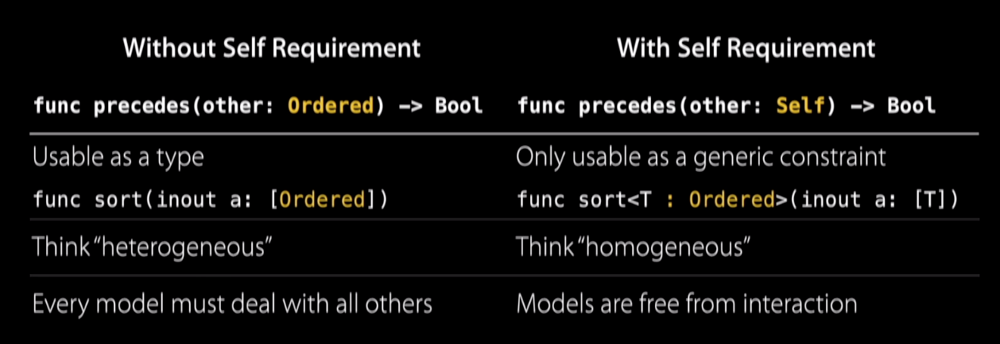

# Introduction 

At the heart of Swift’s design are two powerful programming paradigms: protocol-oriented programming (POP) and class-based inheritance. POP helps solve some of the problems arising from class-based inheritance such as <strong>intrusive inheritance, implicit sharing, and lost-type relationships</strong>.

POP also improves model flexibility with new features such as retroactive modeling using Protocol Extensions. Furthermore, as Swift doesn’t offer multiple inheritances of classes, POP can help achieve that by making classes/structs conform to multiple protocols instead.

In the following sections, we will examine:

- how to apply protocols to achieve greater code performance, flexibility, and maintainability
- highlight new features POP brings i.e. the <strong>Self keyword</strong>
- see some scenarios where class-based inheritance is still preferred

<strong>Disclaimer</strong>: This article aims to summarise the key points raised regarding POP by several really informative and interesting sources (links in the References section). <em>The author would definitely recommend checking out those links.</em>

---

# 1. Use protocols with value types
Unlike traditional subclassing, both structs and classes in Swift can conform to protocols. This eradicates the problem of implicit sharing inherent in inheritance, where classes contain mutable reference semantics. Consequently, the code becomes more maintainable and predictable.

Simply put, implicit sharing is when:

- A hands B some data ‒ But still holds a reference to the data
- If A mutates the data ‒ B is caught off-guard



# 2. Use protocol extensions for greater modular flexibility
Protocol extensions can bring about greater modular flexibility and code reduction in 2 ways:

## a. Retroactive modeling
With extensions, classes or structs can be dynamically remodeled to add new methods. For example, if you wanted to implement methods or operators for CGRect class (provided by the Apple Standard Library), you could do so by creating an extension. Furthermore, the extension can also be made to adopt one or more protocols.

```swift
extension CGRect: Shape {
  func area() -> CGFloat { return size.width * size.height }
}
```

This is also really useful in situations where you might need to handle separate classes or structs in a similar way. For more information, refer to this [video](https://www.youtube.com/watch?v=2CMsgER7WG4).

## b. Default implementation of protocol methods
As there isn’t the concept of Abstract classes in Swift, with inheritance, we have to define all the methods of a base class and any changes later could result in a change in the subclass implementation.

With protocols extension, we can now provide default implementation for methods. This not only improves flexibility by decoupling the protocol from the class/struct, but also can reduce code duplication in common methods between classes or structs conforming to the protocol.

# 3. Use protocols to achieve multiple inheritances
In Swift, multiple inheritances of classes are not allowed. However, when it comes to protocols, there is no limit to how many a struct or class can conform to.

The implication? We can now further refactor our code into protocols that truly do one thing (Single Responsibility principle).

```swift
/** 
 * Adapted Example from Protocol Oriented Programming - Advanced Swift Programming - raywenderlich.com 
 * https://www.youtube.com/watch?v=ekYdBcl3dzs
 */

// Base class for inheritance
class Shape {
  var size: CGSize
  func draw(on context: CGContext) { fatalError("override \(#function)") }
  func area() -> CGFloat { return size.width * size.height }
}

// With refactored protocols
protocol Drawable {
  func draw(on context: CGContext)
}

protocol Geometry {
  var size: CGSize { get }
  func area() -> CGFloat
}

// default implementation of area
extension Geometry {
  func area() -> CGFloat { return size.width * size.height }
}
```

# 4. No override protection for protocols
As protocols do not support final or override keywords that classes do, objects conforming to the protocols might not be alerted when the protocol methods changed.

As shown in the snippet below, `Circle` is not notified when the area method has been renamed to `boundingBoxArea` in Geometry protocols. Though there isn’t an explicit error here, in practice, `area` could have become obsolete and is no longer being called.

```swift
/** 
 * Example from Protocol Oriented Programming - Advanced Swift Programming - raywenderlich.com 
 * https://www.youtube.com/watch?v=ekYdBcl3dzs
 */

protocol Geometry {
  var size: CGSize { get } 
  func boundingBoxArea() -> CGFloat // area -> boundingBoxArea
}

extension Geometry {
  // default implementation means no error raised to Circle
  func boundingBoxArea() -> CGFloat { return size.width * size.height }
}

extension Circle {
  // previous area implementation 
  func area() -> CGFloat { return radius * radius * .pi } 
}
```

# 5. Using Self to avoid lost-type relationships
What are lost type relationships? Suppose we want to implement a `precedes` method in `Ordered` which checks the precedence of `Ordered` objects (refer to code snippet).

If we want to create a new class `Number` implementing `Ordered`, we will have to perform a downcast as we have to preserve the signature of `precedes`. Whenever you see a forced down-cast it is generally a code smell — it is a good sign that some important type relationships have been lost.

```swift
/** 
* Example from: Protocol-oriented Programming in Swift - WWDC 2015 
* https://developer.apple.com/videos/play/wwdc2015/408/
*/
class Ordered {
  func precedes(other: Ordered) -> Bool { fatalError("implement me!") }
}

class Label : Ordered { var textL String = "" ... }

class Number: Ordered {
  var value: Double = 0
  override func precedes(other: Ordered) -> Bool {
    // forced down-cast here is generally a code smell 
    // even though we can make this an optional down-cast, it is still a sign that some type relationship is lost
    return value < (other as! Number).value
  }
}
```

Some of you might then ask: if we use `Ordered` as a protocol, wouldn’t the signature of `precedes(other: Ordered)` remain the same, so the same issue remains?

Here is where we could use <strong>Self</strong>. Self is a placeholder for the type’s that going to conform to that protocol. Let’s see how we could use Self in our `Ordered` example to preserve type information.

```swift
/** 
* Example from: Protocol-oriented Programming in Swift - WWDC 2015 
* https://developer.apple.com/videos/play/wwdc2015/408/
*/
protocol Ordered {
  func precedes(other: Self) -> Bool
}

// value type struct
struct Number: Ordered {
  var value: Double = 0
  // we can now use Number: no more lost type
  override func precedes(other: Number) -> Bool {
    return self.value < other.value
  }
}
```

Now, we want to create a `binarySearch` method, let’s compare how this would look like for the 2 different implementations with and without Self.

```swift
/** 
* Adapted Example from: Protocol-oriented Programming in Swift - WWDC 2015 
* https://developer.apple.com/videos/play/wwdc2015/408/
*/

/** 
* Without Self (protocol or class implementation)
* sortedKeys is a heterogeneous array of Ordered objects which could contain both Number and Label objects
*
* This implementation will raise an error if Self is being used: 
* protocol `Ordered` can only be used as a generic constraint because it has Self or associated type requirements 
*/ 
func binarySearch(sortedKeys: [Ordered], forKey k: Ordered) -> Int {
  ...
}

/** 
* With Self (protocol implementation)
* sortedKeys is a homogeneous array of any single Ordered type T enforced by the compiler
*/
func binarySearch<T: Ordered>(sortedKeys: [T], forKey k: T) -> Int {
  ...
}
```

Notice that with Self, collections have become homogeneous rather than heterogeneous. We have traded dynamic polymorphism for static polymorphism, but in return for the extra type information given to the compiler, it becomes more optimizable [1].

Furthermore, this might be useful in some contexts where we want to compare only among homogeneous objects.
In summary, this table describes the 2 worlds provided by Self-requirement in protocols:


*From the slide of Protocol-oriented Programming in Swift — WWDC 2015 https://developer.apple.com/videos/play/wwdc2015/408/*

# 6. Generic protocols using associated types
There are a few other features that protocols bring to the table: for example, like a Generic class, we also have generic protocols using associated types. For more information, you can refer to this [video](https://www.youtube.com/watch?v=n3unwIghoeE).

# 7. When are classes still preferred over protocols?
So, are classes completely obsolete with the advance of POP? Not at all! Here is a non-exhaustive list of situations where classes are still preferred:

- When you intentionally want implicit sharing ie. when using a value type does not make sense. (Consider a Window object, does it make sense to copy a Window object?)
- Do not fight the system, if a framework expects you to subclass and work with classes, do so! E.g. Swift Cocoa libraries are implemented with classes, and you are expected to inherit these classes and work with them. However, when the class gets too big, you should circumspect and consider using non-classes to refactor your code.

--- 
References:
[1] Protocol-oriented Programming in Swift — WWDC 2015 https://developer.apple.com/videos/play/wwdc2015/408/
[2] Protocol Oriented Programming — Advanced Swift Programming — raywenderlich.com https://www.youtube.com/watch?v=ekYdBcl3dzs
[3] Protocol Oriented Programming — FlawlessiOS — Medium https://medium.com/flawless-app-stories/protocol-oriented-programming-2c448013b96a

