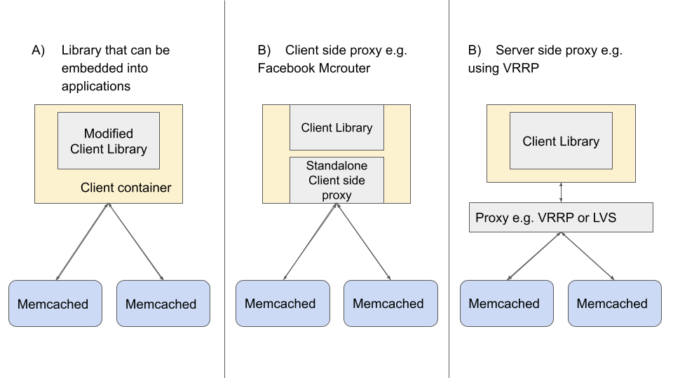

Memcached is a well-known, simple, in-memory cache solution and is used by several large companies such as Facebook, Twitter, and Pinterest. The main use case for Memcached is look-aside caching, to reduce the load on the database. Unlike Redis, Memcached, known for its simplicity, does not offer any in-built high availability features.

## The Problem

As the scale of a cache cluster expands, high availability (HA) becomes a critical issue. How do we respond quickly in situations where a cache server crashes temporarily or even permanently? How do we prevent request overload to our Database servers?
While there have been a few open-source Memcached HA solutions (the most popular being Mcrouter by Facebook), such solutions may not entirely fit one’s business use cases. For example, Mcrouter ensures best-effort eventual consistency (i.e. stale data may still occur especially when there is replication), whereas some specific use cases may require higher data consistency. One might also need more control over tradeoffs between availability, consistency, performance, and cost-effectiveness for different business use cases.
Furthermore, at the time of writing, Mcrouter uses a forked version of Memcached that uses Leases to ensure eventual consistency [1]. Leases are not available in the recent versions of open-sourced Memcached, making Mcrouter non-trivial to adapt in general Memcached infrastructure.

> This article does not aim to describe a fixed solution for scaling Memcached.

Having worked on scaling Memcached for the past 4 months, my aim is to consolidate the key strategies and considerations made to build a highly available cache solution while meeting consistency needs for business use cases. The strategies are not Memcached-specific and could be applied to similar look-aside cache solutions.

## What does a Highly Available Cache Solution Entail

So what does a highly available cache solution entail? We identified three of the most crucial features in a highly available solution:
1. Cache Replication
2. Cold Cache Warmup: Are there any warm backup caches to cushion the increase in load to the database in the event of crash failures?
3. Automatic and Fast Failover: Are we able to detect and correct crash failures fast enough?

While the motivation behind cache replication is similar to having a warm cache backup in the event of node failures, replication can be more powerful because it can also help to increase the total queries per second the Memcached cluster can handle. For example, if we adopt a strategy where read traffic is directed to either replica, the load to a single Memcached can be reduced by a factor of the number of replicas, thus overall across the replicas, we can support higher queries per second (QPS).

However, often in exchange for higher availability, consistency is sacrificed. For example with 2 replica Memcached, we not only must concern ourselves with the consistency between Memcached and DB, but also with the consistency between the 2 replica Memcached.
This is also reported by Amazon that from their experience, there typically exists a trade-off between ACID (C stands for consistency) properties and availability. We will discuss strategies that balance this trade-off in the later section.

## Main Business Use Cases for Caching

To understand how to balance the trade-off between consistency and availability, we need to identify the business use cases and their needs. There are generally 2 main categories of use cases for caching:
1. Look-aside cache (Database is the authoritative source of truth)
2. Cache as authoritative storage (where the cache is now an authoritative source of truth)

While the main usage of Memcached typically is as a look-aside cache, some business use cases may make use of the cache as the authoritative storage in which consistency may become more important.


<p style="text-align: center;">Figure 1: The remote marker mechanism uses Memcached as an authoritative source of data to store markers. This mechanism is used to minimize the probability of reading stale data in replica databases.</p>

In Facebook’s Scaling Memcached paper, a use case for the cache as authoritative storage is described: a remote marker mechanism is used to minimize the probability of reading stale data in replica databases for use cases that requires a strong level of consistency. The problem described in the paper originates from the fact that replica databases may lag behind the master database (DB) and sometimes this replication lag is non-negligible (e.g. when the master DB and replica DBs are in different geographical regions).

As seen in Figure 1, when new data is written in the master DB, the client will also write a marker into Memcached. Typically the expiration time for the marker is very short. Subsequently, before a client reads the data from the DB, it will check if the remote marker exists in the cache. If the marker exists, it implies that the data is recently written or updated, and the client will read from the master DB, else, it will read from the replica DBs.

## Choosing the Right Consistency Guarantees

After identifying our business use cases, we need to select the right consistency guarantees. For example, in the cache as an authoritative storage use case, we might need a strong consistency between Memcached replicas because the data is only stored in the cache and the cache is the authoritative source of truth. In other business situations, eventual consistency might be sufficient, and we can focus our strategies towards maintaining higher availability or optimizing performance.

There are 2 main consistency relations we need to consider:
1. Consistency between Memcached replicas (if replication is employed)
2. Consistency between the Database and Memcached

As our focus is on scaling Memcached infrastructure, we will not concern ourselves with the consistency between Master DB and replica DBs.

The following are several consistency levels that are typically required on a business level. Keep in mind that high consistency is usually a trade-off for availability, performance (low latency, high throughput), or/and cost.

### 1. Strong consistency
Strong consistency between Memcached replicas guarantees that Memcached replicas have the same data and that different read requests to the replicas will return the same result. Such strong consistency between Memcached replicas may be required in cases when the cache is used as authoritative storage, or when inconsistent data could have critical business repercussions. For example, in the case of the remote marker mechanism (described above), a cache miss could lead to clients reading from the replica DB which may contain stale data.

### 2. Eventual consistency
Eventual consistency guarantees that if no new updates are made to a given data item, eventually all get requests to that item will return the last updated value. Most if not all cache use cases will require at least eventual consistency.
### 3. Allowing stale data (for a limited time) in exchange for lower latency
By identifying situations where returning slightly out-of-date data is acceptable, we could employ strategies that allow stale data to be returned for a bounded time in order to reduce latency.
### 4. Sequential consistency

By Lamport’s definition:

> Sequential consistency implies that operations appear to take place in some total order, and that that order is consistent with the order of operations on each individual process.

In the context of distributed cache, sequential consistency guarantees that the order of operations received by the Memcached server is consistent with the partial order of operations sent by each individual client. That is, every client sees that their operations are performed in order (even though their operations may be interleaved with operations sent by other clients).


## Strategies to Scale A Distributed Cache
After analyzing our business cases and the consistency level they require, we are now ready to discuss strategies to scale our distributed cache solution. Each of the strategies discussed arises from different problems faced in production when scaling the Memcached infrastructure.

### 1. Performing cache invalidations upon data update
One problem that arises in Memcached infrastructure is race conditions from concurrent writes, leading to infinitely stale data present in the cache. This can be detrimental to the business logic because even eventual consistency is not guaranteed.
For example, consider a single instance of Memcached where concurrent writes from clients may sometimes be re-ordered, i.e. if we employ a naive “write to DB then write to cache” strategy, the order of writes to DB may differ from the order of writes to Memcached, which leads to indefinitely stale data. The main problem is because <strong>writes are not idempotent nor commutative</strong>.

> “We choose to delete cached data instead of updating it because deletes are idempotent. Memcache is not the authoritative source of the data and is therefore allowed to evict cached data” [1].

A common strategy to avoid this issue is to use cache invalidation upon updating the DB because deletes are idempotent. For example, in the Scaling Memcached at Facebook paper [1], authors present that upon a DB write for a data item x, an invalidation pipeline that runs a daemon mcsqueal will read the DB log and then, issue invalidation for the same data item x (i.e. delete command) to Memcached. Then, when a client receives a cache miss, they will get the data item directly from the DB and write the most recent value to Memcached.

To prepare for unexpected cases such as transient network failure, we need to ensure that the invalidation daemon keeps retrying delete commands in the same order until succeeded so that invalidation requests are not lost in the event when a Memcached instance disconnects. To reduce the load on the invalidation pipeline during a node failure, the retry can be implemented in an exponential backoff fashion.


<p style="text-align: center;">Figure 2: Adapted from [1].</p>

This approach minimizes the risk of concurrent writes being re-ordered because deletes are idempotent, and if multiple clients update the same data item concurrently, the database will be responsible for ordering the updates and delete the data item from Memcached.
However, there is still a small risk of ending up with stale data using this strategy. Consider the given race condition:

```
# Credits to https://pdos.csail.mit.edu/6.824/notes/l-memcached.txt

k not in cache
C1 get(k), misses
C1 v1 = read k from DB
  C2 writes k = v2 in DB
  C2 delete(k)
C1 set(k, v1)
now mc has stale data, delete(k) has already happened
will stay stale indefinitely, until k is next written
```

To solve this issue, Facebook uses a CAS-like (check-and-set) approach called leases on the Memcached server side. However, at the time of writing, Leases are not available in the recent versions of open-sourced Memcached.

### 2. Client-side vs server-side approach
While scaling cache infrastructure, it is usually a good idea to embed the complexity of the system into either a stateless client or standalone proxy. This greatly simplifies Memcached and allows one to focus on making it highly performant for specific use cases. In order to scale up Memcached infrastructure, we found that there are three general approaches we can take:
- Library that can be embedded into applications (client-side approach)
- Standalone proxy (can be a client-side proxy process like Mcrouter or server-side proxy)


<p style="text-align: center;">Figure 3: Three general approaches when scaling cache infrastructure.</p>

An example of a standalone client proxy is Mcrouter [1] which is typically deployed as a sidecar of the client machine, meaning it is separate from the client API library [5]. An example of a server-side proxy is to deploy an LVS load balancer to split traffic amongst different Memcached replicas in the same consistent hashing slot. The main advantage of using a standalone proxy solution is that there is less or no code modification on the client side.

Deploying a server-side proxy as compared to a client proxy also reduces the need for code addition and changes, thus lowering the risk of bugs and making it easier for existing teams to convert to the new solution. However, a server-side proxy may require additional cost (in the form of another physical machine / dedicated rack). We will look into how we can use both strategies to achieve High Availability in the Replication Strategies section.

### Replication Strategies
We have seen in the Consistency section that different business needs may require very different consistency or availability guarantees. Sometimes, we may even need to cater to more than one vastly different use case in the same cache infrastructure. To meet these business objectives, we have to employ specific strategies to balance these trade-offs. We will discuss a few of these replication strategies in this section. Note that the scale in which we are examining is one specific replication cluster (i.e a single slot of the consistent hashing algorithm).


<p style="text-align: center;">Figure 4: The scale in which we are examining is one specific replication cluster (i.e a single slot of the consistent hashing algorithm).</p>

1. Primary Memcached node with automatic failover to cold backup
2. Write to any node; Get from any node.
3. Write to all nodes; Get from any node
4. Write to all nodes; Get only from primary Memcached node

#### Primary Memcached node with automatic failover to cold backup
This strategy doesn’t support replication or warm cache backup; it mainly supports automatic failover when the Memcached node fails. In the event of a Memcached failure, routing traffic to a cold cache will lead to cache misses and hence an increase in DB load. However, if the DB can withstand a few Memcached nodes’ worth of load, this solution may be suitable as a temporary solution.

A possible implementation of this strategy is by using a server-side strategy: We can add a layer of Virtual Router Redundancy Protocol (VRRP) between the client and Memcached servers. VRRP performs automatic failure detection and failover such that if the active physical Memcached master fails, another physical machine will be selected to automatically replace it.

#### Write to any node; Get from any node.
Note that Facebook implemented this strategy using a client-side proxy Mcrouter. This strategy can also be implemented in the form of a server-side proxy using a load balancer such as LVS to split traffic between Memcached replicas.

<em>Pros:</em> Replicas split the load of traffic amongst themselves, thus, overall more QPS can be supported. Since the split of traffic is random, we can expect the key distribution to be even among the replicas. Thus, we are guaranteed to have warm backups in the event of a portion of the replicas failing.

<em>Cons:</em> Cannot ensure repeatable reads amongst replicas because writes are not guaranteed to end up in all replicas. For use cases that require high level of consistency such as using the cache as authoritative storage, this solution may not be sufficient.


#### Write to all nodes; Get from any node

This strategy aims to support full replication in all replicas, i.e. writes will be propagated to all replicas (synchronously).

<em>Pros:</em> If implemented properly, can support a high level of consistency among different Memcached replicas. Since the requests are split among the different replicas, overall QPS that can be supported in one consistent hashing slot also increases by the factor of the number of replicas.

<em>Cons:</em> It is not trivial to guarantee that all Memcached replica will be consistent with each other, especially with a client side approach. This is because we have to manage the situation when a write to Memcached fails due to temporary network delays.

#### Try to write to other nodes; Get only from the primary Memcached node

This strategy relaxes the condition of the previous strategy: i.e. attempt to achieve full replication. Upon a cache miss, Memcached will fetch the new data from DB and write to the primary Memcached node in a synchronous fashion, before writing to the secondary nodes in an asynchronous fashion. Get queries will only be directed to the primary Memcached.

<em>Pros:</em> Able to maintain warm Memcached replica backups assuming that a majority of the asynchronous writes will succeed. Since Get queries are only handled by the primary Memcached node, in most normal situations, it is not as critical to ensure consistency between primary node and backups.

<em>Cons:</em> Again, it is not trivial to guarantee all replicas will be consistent with one another. In the event that the primary Memcached node fails, the backup that is promoted to the primary node may contain some stale data.

Furthermore, since only one primary node is utilized in handling all query traffic, the overall QPS that can be supported in one consistent hashing slot remains the same.

### 4. Achieving Failover
Failover refers to the act of falling back onto a secondary service/machine if the primary machine fails. Failover is a critical aspect of any high availability solution and includes two main components: Failure detection and gradual failover to another Memcached replica or backup. Ideally, we want to achieve fast failover and sometimes automatic failover.

One common way to detect node failures is to perform a health check is via sending periodic heartbeat to servers using a Daemon script. Servers that reply to the heartbeat are deemed healthy and we can keep track of this healthy list of servers in a central configuration center like ETCD/Zookeeper which can be accessed by the client processes. One possible way to support gradual failover is via server-side strategies such as VRRP which supports such high availability features.

---

In conclusion, as the scale of Memcached increases, one has to keep in mind the trade-offs between consistency, availability, and performance and this intricate balance between these factors depends on the business use cases that Memcached is supporting.
Thank you for reading! Do check out my earlier post on how to benchmark Memcached performance here:
---

# References
[1] Scaling Memcached at Facebook https://www.usenix.org/system/files/conference/nsdi13/nsdi13-final170_update.pdf

[2] Dynamo: Amazon’s Highly Available Key-value Store https://www.usenix.org/system/files/conference/nsdi13/nsdi13-final170_update.pdf

[3] Memcached https://memcached.org/

[4] Notes on Scaling Memcached at Facebook https://pdos.csail.mit.edu/6.824/notes/l-memcached.txt

[5] Scaling Cache Infrastructure at Pinterest https://medium.com/pinterest-engineering/scaling-cache-infrastructure-at-pinterest-422d6d294ece

Check out post here on Medium! [https://levelup.gitconnected.com/lessons-learnt-from-scaling-memcached-in-production-86778ab616c7](https://levelup.gitconnected.com/lessons-learnt-from-scaling-memcached-in-production-86778ab616c7)
