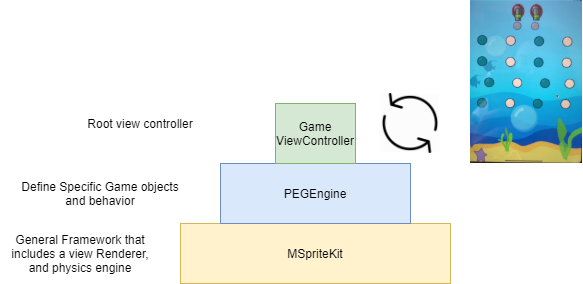
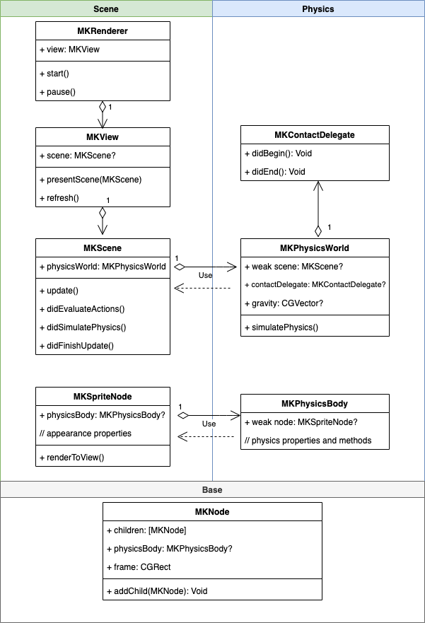
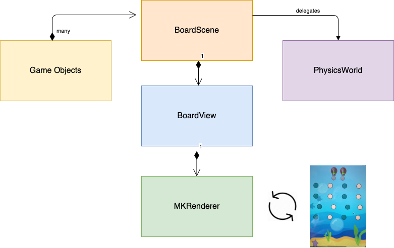
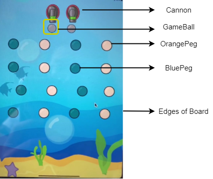
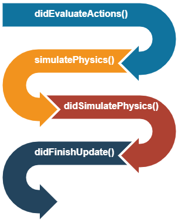
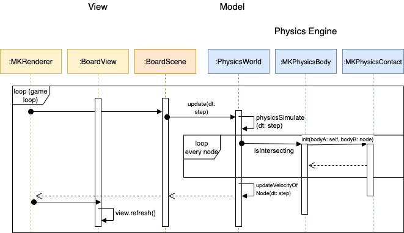

##### Introduction:

These two weeks, I've been building a physics engine from scratch for Peggle2.0. Here, I proudly present the Developer Guide:

This developer guide will discuss the general structure of an implementation of the Peggle2.0 Game Engine (PEGEngine) and a general framework that includes a Scene Renderer and physics engine, MSpriteKit that is highly inspired by Apple’s own SpriteKit.

The product Peggle2.0Game can be viewed here: https://youtu.be/9iCi77J2ZKo

---

## High Level Architecture

### General

The 3 main components of the Peggle2.0Game are:

- _MSpriteKit_: The Foundation: Supplying the Physics Engine, Scene builders and a View Renderer which is non-specific to any game
- _PEGEngine_: A Peggle2.0 specific engine which specifies the appearances and behaviors of game objects
- _GameViewContoller_: The root view controller of the app, which setups a pre-loaded `Board` into the View, and start the renderer running.



_Figure 1: Relationship between MSpriteKit, PEGEngine and GameController_

### MSpriteKit

MSpriteKit strives to be a general-purpose framework for drawing edges, and volume based nodes in two dimensions. It includes an in-built view renderer, while offering a simple programming interface to make it easy to create games and other graphics-intensive apps. Equipped with a set of animations and physics behaviors, you can quickly add life to your visual elements.

MSpriteKit, like the original SpriteKit by Apple, is split into 3 distinct components:

- Base: `MKNode` is the base class of all MSpriteKit nodes.

- Scene Building and View Renderer: Display visual content using MSpriteKit.

  - `MKRenderer`: MSpriteKit's inbuilt view renderer that drives the scene update cycle.
  - `MKView`: MKView converts game objects from MKScene into UIView that are contained within itself (MKView)
  - `MKScene`: An object that organizes all of the active MSpriteKit content.
  - `MKSpriteNode`, `MKEdgeNode`: Onscreen graphical elements that can be initialized from an image, a solid color or as an edge.

- Physics Simulation: Add physics behaviors to nodes in your scene.

  - `MKPhysicsWorld`: The driver of the physics engine in a scene; it exposes the ability for you to configure and query the physics system.
  - `MKPhysicsBody`: An object that adds physics simulation to a node.
  - `MKPhysicsContact`: A description of the contact between two physics bodies.
  - protocol `MKPhysicsContactDelegate`: Methods your app can implement to respond when physics bodies come into contact.



_Figure 2: General Architecture of MSpriteKit (more on specific classes in Section 2&3)_

### PEGEngine

A game engine built on top of MSpriteKit specifically made for a remade Peggle 2.0. The game engine encapsulates the game objects and their behaviors when interacting with other game objects.

Here, BoardScene extends MKScene, containing a list of Game Objects and contains a PhysicsWorld. The BoardView extends MKView and is refreshed by the Renderer each frame to render the different game objects into UIViews.



_Figure 3: General Architecture of PEGEngine_



_Figure 4: Game Objects Classes using in PEGEngine_

## Scene Building and View Rendering

### MKRenderer (i.e. Game Loop)

MKRenderer is an in-built View Renderer of MSpriteKit. It contains a Game Loop (implemented using the CADisplayLink) that drives the scene update and view refresh cycle every frame.

The Game Loop implemented in MKRenderer is highly inspired by [4].

![Figure 5: Play catch up during Physics update in game loop (adapted from [4])](GameLoop.png)

_Figure 5: Play catch up during Physics update in game loop (adapted from [4])_

At the beginning of each frame, a variable lag is updated based on how much real time has passed compared to the state of the BoardScene. We then use an inner loop to update the game, one fixed step at a time (calculated using the preferredFramesPerSecond) until the game’s clock has caught up with the real world time.

After updating the game state, the view is rendered (or refreshed). After which, MKRenderer exposes a method didViewRefresh() for any actions to be performed after the view is updated to be called.

In Peggle2.0, the Game State is checked in didViewRefresh(): if the game is won, a game alert will pop up informing the user. We only want the game alert to pop up when the user has visualised his win. The initial ball launch is also performed using UITapGestureRecognisers which wait for user input.

#### MKView `refresh()`

- var `fadingOutNodes`: nodes that will be undergoing animation

The view rendering function is named refresh() in MSpriteKit. The refresh method is called every frame by the Game Loop.

The refresh method performs two separate procedures:

1. It handles fading out animation (and subsequent callback from the animate function). This could be extended to handle general animating views in future (assuming that animating views do not get updated simultaneously i.e. all of the changes is encapsulated by the animation and its callback).

2. It renders the rest of the views (non-fading views).

```swift
/// Refresh the view every frame
func refresh() {
  fadeNodes(nodes: fadingOutNodes)

  renderNonFadingViews()
}
```

### MKScene update()

MKScene update function performs these scene update lifecycle methods in the following order. These methods can be overridden by subclasses to accommodate game-specific actions before and after the physics simulation.



_Figure 6: Update Scene Lifecycle Methods_

## Physics Engine of MSpriteKit:

### MKPhysicsWorld simulatePhysics()

The MKPhysicsWorld of MKScene performs simulatePhysics() to update new positions at each time step (refer to Figure 7 for the update scene lifecycle methods). The physics world performs 4 main procedures each frame:

1. Generate new positions for each game object

2. Resolve any collisions in the new positions generated

3. Update the scene with the new positions

4. Update the velocity of nodes for that time step (i.e. time in account velocity changes from collision events or effect of forces applied to the node such as gravity)

```swift
/// Simulate physics and updates position and velocity of nodes
func simulatePhysics(dt: TimeInterval) {

  let newPositions = generateNewPositions(dt: dt)

  // Collision: where that happens, resolve collision by adjusting the position to the point of collision
  resolveCollisions(newPositions: newPositions)

  updateScene(newPositions: newPositions)

  updateVelocityOfNodes(dt: dt)
}
```

### MKPhysicsBody

Every MKSpriteNode (i.e. MSpriteKit’s game object) can be assigned a corresponding MKPhysicsBody to add physics simulation to the node. When a scene processes a new frame, it performs physics calculation on physics bodies attached to nodes in the scene. These calculations include gravity, friction, collisions with other bodies. You can also apply your own forces and impulses to a body. After the scene completes these calculations, it updates the positions and orientations of the node objects.

A MKPhysicsBody is characterised by different shapes:

- EdgeLoop: 4 edges (of 0 width) around the frame
- Circle: defined by a center and a radius

The essential methods of MKPhysicsBody include:

- `isIntersecting(other: MKPhysicsBody)`
- `updateVelocityAfterCollision(contact: MKPhysicsContact)`

##### CollisionBitMask and CategoryBitMask:

Inspired by the original SpriteKit, every physics body in a scene can be assigned to up to 32 different categories, each corresponding to a bit in the bit mask. By defining the mask values, you can define which physics bodies interact with each other and when your game is notified of these interactions.

- _CategoryBitMask_: A mask that defines which categories this physics body belongs to.
- _CollisionBitMask_: A mask that defines which categories of physics bodies can collide with this physics body.

For instance, in PEGEngine we define several masks to simulate different physics behaviors (i.e. moving ball to stationary peg, moving ball to stationary wall etc):

```swift
struct PhysicsCategory {
    static let none: UInt32 = 0
    static let all: UInt32 = UInt32.max
    static let ball: UInt32 = UInt32.max
    static let peg: UInt32 = 0b10
    static let cannon: UInt32 = 0b100
    static let wall: UInt32 = 0b1000
}
```

We set `ball.CollisionBitMask = all` indicating that the ball collides with all physicsBodies.

#### Extensions:

Future extension of the MKPhysicsBody structure will be to adhere more to the Separation of Concern principle and instead of simply using the MKPhysicsBody to represent multiple shapes and functions, we could have several protocols and mixing classes. This idea is inspired by a classmate.

- Collideable and Moveable protocols
- Edge, Circle, Rectangle physicsBody protocol

### Step-by-step from detecting a collision to handling it:



_Figure 7: Step() of MKRenderer is called and triggers collision detection and handling each step._

1. In each frame of the Game Loop, scene.update(dt: gameStep) is called. This runs the BoardScene.update method which runs the scene update lifecycle procedures.
2. Of the procedures, physicsSimulate(dt: gameStep) will be triggered (refer to the above section on MKPhysicsWorld).
3. Detection of collisions occurs during the resolution of collisions and will be added to a list of MKPhysicsContact objects.
4. The list of collisions will be handled (i.e. responsible physicsBodies will have their velocity updated from the collision) in the updateVelocityAfterCollision() method of MKPhysicsBody.
5. (Typically) The scene.update method then exits and the view.refresh() method is called to render the newly positioned nodes into the BoardView.

---

---

~ Melodies

### References

[1][more about peggle](https://cs3217.netlify.com/docs/problem-sets/problem-set-2)

[2][spritekit docs](https://developer.apple.com/documentation/spritekit)

[3][swift docs](https://swift.org/documentation/)

[4][game programming - game loop](http://gameprogrammingpatterns.com/game-loop.html)
