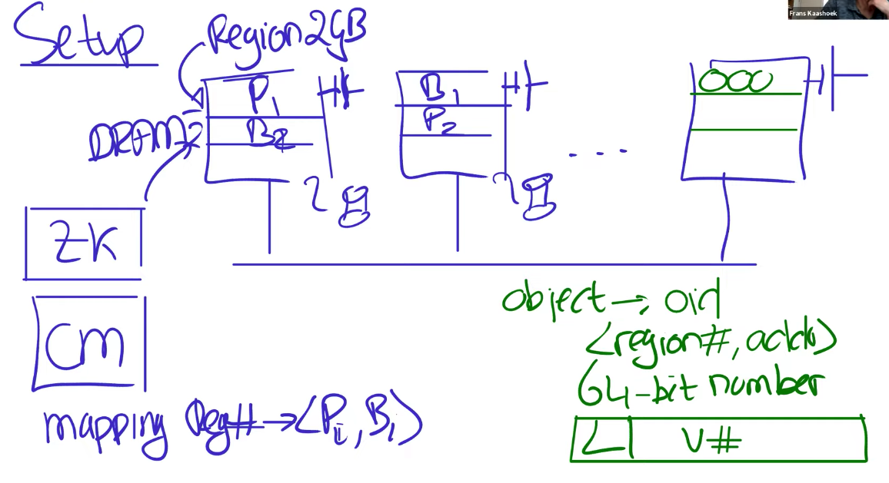
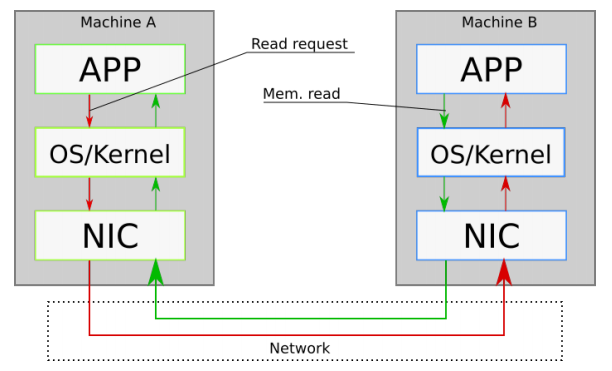
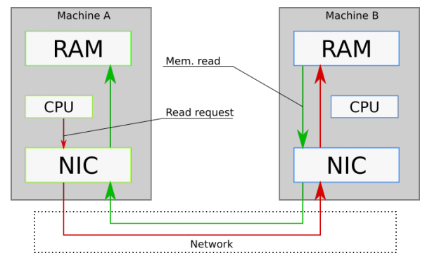

```toc
# This code block gets replaced with the TOC
```

## What is FaRM
FaRM: Fast Remote Memory, is a in-memory distributed computing platform. FaRM provides distributed ACID transactions with strict serializability, high availability, high throughput and low latency. 

FaRM leverages 2 hardware trends appearing in datacenter (DC):
1. Fast commodity networks with RDMA
2. Inexpensive approach to provide non-volatile DRAM

These trend eliminate storage and network bottlenecks but exposes CPU bottlenecks that limit the performance benefits brought by these hardware. 

To reduce CPU bottlenecks, FaRM's protocol follow 3 principles:
1. Reduce message counts
2. Using one-sided RDMA reads and writes instead of messages
3. Exploit parallelism 

## Why are we reading the FaRM paper? 
- Another take on fault-tolerant transactions (atomicity and strict serializability) + sharding. The previous time we examine Spanner which has the same guarantees. 
- Open research area! 
- Motivated by huge performance potential of RDMA NICs.

### How does FaRM differ from Spanner? 
**Spanner:**
- Deployed system in Google
- Focuses on geographical replication across different datacenters
- Most innovative for read-only transactions which does not use locks and uses TrueTime API 
- Performance: read-write transactions take 10-100ms, read-only transactions has a mean of 8.7ms. 

**FaRM:**
- Still a research prototype, to explore potential of RDMA 
- All replicas are in the same data center 
- (One-sided) RDMA restricts design options: Uses OCC 
- Performance: 58us for simple transactions (100x faster than Spanner r/w transactions) 

They target different bottlenecks: (to be elaborated more in Section [#](#how-does-farm-get-high-performance))
- Spanner: speed of light and network delays
- FaRM: CPU time on servers

## High Level Architecture 
First, let's examine a high level overview of FaRM's architecture to understand each component.

 - All replicas are in a single datacenter 
 - Each machines has multiple regions to store different shards (primary and backups)
 - Data is sharded using [Primary/Backup Replication](https://levelup.gitconnected.com/deep-dive-into-primary-secondary-replication-for-fault-tolerance-6ba203b06901?sk=b64df95dd08bb34cff01528bb3069311) (P/B replication) instead of using Paxos in Spanner. 
   - One benefit of P/B replication is that with $f+1$ replicas we can tolerate $f$ failures. For Paxos we need majority of servers so to tolerate $f$ failures, we need $2f+1$ replicas instead. More replicas means more cost, and higher message counts. 
  
 - Uses non-volatile DRAM and uninterrupted power supply (UPS)
 - 1 unreplicated Configuration manager (CM). Configurations are replicated by Zookeeper (ZK). Configuration includes P:B mappings to different machines and regions). 
 - Transactions clients can decide to start a transaction and act as the 4-phase commit Transaction Coordinator (TC). 



## How does FaRM get high performance?
**Main Idea:** 

- FaRM  overcomes both Memory Read/Write (no disk read or writes!) and Network (using one-sided RDMA instead of RPC) bottlenecks. 
- FaRM is bounded by CPU bottleneck - use Kernel bypass to reduce this. 
- Spanner is bounded by network message delays because of 2PC (using RPC) and cross-geographical messages. 

### Performance Tradeoffs

At a high level, some optimizations and tradeoffs that FaRM makes to provide its guarantees are: [3]

- The data must fit in the total RAM, so there are no disk reads.

- It makes use of non-volatile DRAM, so there are no disk writes under normal operations.

- FaRM's transaction and replication protocol take advantage of one-sided RDMA for better performance. RDMA means a server can have rapid access to another server's RAM while bypassing the other server's CPU.

- FaRM also supports fast user-level access to the Network Interface Card (NIC).

Let's now learn about these optimizations in greater detail.

### Non-volatile DRAM

A FaRM server stores data in its RAM, which eliminates the I/O bottleneck in reading from and writing data to disk. For context, it takes about 200ns to write to RAM, while SSD and hard drive writes take about 100μs and 10ms respectively [1]. Writing to RAM is roughly 500x faster than writing to SSD, and we gain a lot of performance from this optimization [3]. 

But by storing data in RAM, we lose the guarantee that our data will survive a power failure. FaRM provides this guarantee by attaching its servers to a distributed UPS, which makes the data durable. When the power goes out, the distributed UPS saves the RAM's content to an SSD using the energy from its battery. This operation may take a few minutes, after which the server shuts down. When the server is restarted, FaRM loads the saved image on the SSD back into memory. Another approach to making RAM durable is to use NVDIMMs, but the distributed UPS mechanism used by FaRM is cheaper [3].

Note that this distributed UPS arrangement only works in the event of a power failure. Other faults such as CPU, memory, hardware errors, and bugs in FaRM, can cause a server to crash without persisting the RAM content. FaRM copes with this by storing data on more than one replica [3]. 

This eliminates the bottleneck in accessing the disk. 

### Networking and CPU Bottlenecks

At a high level, communication (usually by RPC) between two computers on a network is as shown in the Figure below [4]. 



In this setup, we see that communication between two machines A and B on a network goes through the kernel of both machines. This kernel consists of different layers through which messages must pass. This stack requires a lot of expensive CPU operations—system calls, interrupts, and communication between the different layers—to transmit messages from one computer to another, and these slow the performance of network operations.

FaRM uses two ideas to improve this networking performance:

1. **Kernel bypass**: Here, the application interacts directly with the NIC without making system calls or involving the kernel.
2. **One-sided RDMA**: With one-sided RDMA, a server can read from or write to the memory of a remote computer without involving its CPU.

Application interacts directly with the NIC without making system calls or involving the kernel. E.g. DPDK which allows application to poll directly from NIC queues. 

The Figure below [4] highlights these ideas. In the figure, we see that the CPU of Machine A communicates with the NIC without the kernel involved (kernel bypass), and the NIC of Machine B bypasses the CPU to access the RAM (one-sided RDMA).



### More on one-sided RDMA 

Note that each FaRM machine maintains logs which they use as either transaction logs or message queues. These logs are used to communicate between sender-receiver pairs in a FaRM cluster. The sender appends records to the log using one-sided RDMA writes, which the receiver acknowledges via its NIC without involving the CPU. The receiver processes records by periodically polling the head of its log.

**Main Idea:** The idea of the sender and receiver executing parallely is similar to the idea in Linux interrupt mechanism in the kernel where the top-half and bottom-half can operate parallely and without blocking. This maximise concurrency and improve performance. 

**Challenges: How can we bypass the CPU for one-sided RDMA?**

- However, previous transaction protocols (2PC + 2PL) requires active server (CPU on server side) participation. 
- But one-sided RDMA bypasses the CPU, so it is not immediately compatible with these protocols. How then can we ensure consistency while avoiding the CPU?

## FaRM: Transactions

```
FaRM transaction API (simplified):
  txCreate()
  o = txRead(oid)  -- RDMA
  o.f += 1
  txWrite(oid, o)  -- purely local
  ok = txCommit()  -- Figure 4
```

### Concurrency Control (CC)

FaRM uses Optimistic Concurrency Control (OCC) which reduces the need for active server participation when executing transactions. FaRM also uses the 4 phase commit: EXECUTE, LOCK, COMMIT-BACKUP, COMMIT-PRIMARY. For more details on the 4 phase commit, refer to the paper [1]. 

#### Pessimistic 

When a transaction wants to read or write an object, it first attempts to acquire a lock. If the attempt is successful, it must hold that lock until it commits or aborts. Otherwise, the transaction must wait until any conflicting transaction releases it lock on the object.

E.g. Spanner (2PL for read/write transactions to ensure serializability)

#### Optimistic (OCC)
In OCC, we can run a transaction that reads and writes objects without locking until commit time. The commit stage requires validating that no other transactions changed the data in a way that conflicted with ours. If there's a conflict, our transaction gets aborted. Otherwise, the database commits the writes.


## Conclusion
FaRM is very impressive; does it fall short of perfection?

  * works best if few conflicts, due to OCC.
  * data must fit in total RAM.
  * replication only within a datacenter (no geographic distribution).
  * details driven by specific NIC features; what if NIC had test-and-set?
  * requires somewhat unusual RDMA and NVRAM hardware.


## References
[1] Castro et al (2015). Microsoft Research. No Compromises: distributed transactions with consistency, availability and performance.

[2] https://pdos.csail.mit.edu/6.824/notes/l-farm.txt

[3] https://timilearning.com/posts/mit-6.824/lecture-14-occ/

[4]: Lecture Notes on Distributed Systems(Fall 2017) by Jacek Lysiak