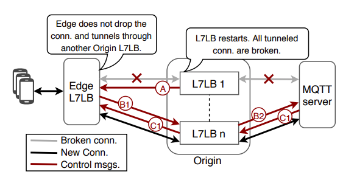

```toc
```
### What were the problems Facebook was trying to solve? 

Facebook needed a framework to reduced disruptions and downtime during code release that required servers to restart (disruption-free release system).

This need arises from: 

1. Servers are restarted frequently. 
   - Adoption of "Continuous Release" philosophy 
   - Each release brings about possibility of disruptions (see Figure 1)
2. Complicated by scale and heterogenity of supported services and protocols 
   - Billions of users and connections meant that restart of connection (TLS/TCP need handshakes) can lead to disastrous for ISP, end-users and OSP. 
3. State of the art to deploy code changes involves draining connections and incrementally restarting servers to introduce new code. 


<p style="text-align: center;">Figure 1: Implication of current state of the art way to deploy new code for Facebook. Adapted from [2].</p>

4. Specific challenges for Facebook context
   -  Employ large range of protocols and services.
   - Non-trivial set of apps (e.g. long-lived connections used to transfer large objects) are stateful - update mechanisms must seamlessly migrate or recreate the state at new server.
   - Subset of servers are resource-contrained and are unable to run both new code and old code on the same server. 


### Unique characteristics of Facebook 
Important characteristics that Facebook zero downtime release framework built upon: 

1. E2E infrastructure is owned and administered by FB provider --> updates in a specific tier, can leverage a downstream tier to shield the end-user from disruption.
2. For long lived connections with large objects, we can recreate the state by identifying the partial requests at the old server and replaying them to the new server. 

### Facebook Network Infrastructure


<p style="text-align: center;">Figure 2: End-to-end infrastructure. Adapted from [1].</p>

The article focuses on **restarts of Proxygen (both at Edge and Origin) and HHVM App. Server (at DataCenter)**. 

Let's how user requests are processed by the different tiers of the infrastructure: 

(1) Edge PoP serves as the gateway into our infrastructure for a user’s request and connections (TCP and TLS). These user re- quests/connections are terminated by the Edge Proxygen.

(2) Edge Proxygen processes each request and, if the request can- not be serviced at the Edge, it forwards the request to the upstream Origin DataCenter. Otherwise, for cache-able content (e.g., web, videos etc.) it responds to the user using Direct Server Return.

(3) Edge and Origin maintains long-lived HTTP/2 connections over which user requests and MQTT connections are forwarded.

(4) Origin Proxygen forwards the request to the corresponding App. Server based on the request’s context (e.g., web requests to HHVM, django servers while persistent pub/sub connections to their respective MQTT broker back-ends).

## Zero Downtime Release

### Ideal Disruption-free release system 

The ideal disruption-free release system is expected to:

1. Generic: Generalizes across the different services and protocol. 

2. Preserve State: Should either reserve or externalize states to prevent the overhead of rebuilding them after restarts.

3. Tackle long-lived connections: Draining period is not enough for them to gracefully conclude.

## 1. Socket Takeover

**Goal**: To address the issue of having to restart connections in the restarted/new server. 
- Spin up an updated process that takes over the listening sockets
- Old connections (accepted/ESTABLISHED sockets) are served by the older process until the end of draining period (after which DCR can kick in). 

**General Technique**: Passing FDs for each listening socket from the older process to the new process --> Listening sockets are never closed (no downtime). 

1. Use sendmsg(2) and recvmsg(2) of a UNIX domain sockets to pass FDs between processes. 
2. Use SCM_RIGHTS to indicate the type of messages to send/receive (i.e. FDs).

**Take note:** The old and new processes must run parallel on the same machine. Caveat: CPU and memory overhead (especially for draining duration). 

### TCP vs UDP 
We will recall some of the key differences between TCP and UDP that will affect how Socket Takeover differs for both protocols. 

1. TCP is connection-oriented; has 2 types of sockets: listening sockets and accepted (ESTABLISHED) sockets. 
   - Usually the accept sockets carries state (state stated in the worker/thread that accepted the socket)
   - Listening sockets' main objective is usually to accept socket (thus, typically do not contain any state required for processing the requests)
2. UDP is connectionless, however, there are protocols such as QUIC and webRTC built on top of UDP that maintain states for each flow. 

### Strategy for TCP

For TCP sockets, only FDs of listening sockets are sent to the new process over UNIX-domain sockets. 

Accepted connections are processed by older instance until end of draining period. 

For TCP connections, the separation of listening and accepted sockets by Linux Kernel lessens the burden to maintain consistency from the user-space application. 

### Strategy for UDP

FB uses [SO_REUSEPORT](https://tech.flipkart.com/linux-tcp-so-reuseport-usage-and-implementation-6bfbf642885a) to open multiple listen sockets to process incoming connections  which solves both the problem of a single process bottleneck, as well as connection skew between processes (Refer to Figure 3).


<p style="text-align: center;">Figure 3: Server with and without SO_REUSEPORT. Adapted from [4].</p>

**Problem 1:** When using SO_REUSEPORT, the connections are evenly distributed among the listen sockets using a hashing function (socket ring). 
- The hash function is hashed on the source_ip:port. 
- The hash function changes if sockets are created or removed. 
- If this happens, misrouting of UDP packets to different processes may occur. This is not ideal for stateful protocols built on top of UDP. 

**Solution 1:** Pass the FDs of all UDP VIP sockets -- equivalent to calling dup() on the existing socket FD, i.e. copy the existing FD and avoid creation of new FD for this socket. 
- This means hash function will remain the same. 
- No more misrouting of packets. 

**Problem 2:** All packets are routed to the new process, including the ones for connections owned by the old process. Again, this is not ideal for stateful protocols like QUIC. 

**Solution 2:** New process employs user-space routing and forwards packets to the old process through a pre-configured host local address. 
- Decision for user-space routing are made based on information present in the UDP datagram e.g. connection ID that is present in the QUIC packet header. 

### Workflow 


<p style="text-align: center;">Figure 4: Socket takeover workflow. Adapted from [1].</p>

In existing Proxygen process that is serving traffic has already bound and called accept() on socket FDs per VIP. 

<ol type="A">
  <li>The old Proxygen instance spawns a Socket Takeover server that is bound to a pre-specified path and the new Proxygen process starts and connects to it.</li>
  <li>The Socket Takeover server then sends the list of FDs it has bound, to the new process via the UNIX domain socket with sendmsg() and CMSG. </li>
  <li>The new Proxygen process listens to the VIP corresponding to the FDs.</li>
  <li>It then sends confirmation to the old server to start draining the existing connections.</li>
  <li>Upon receiving the confirmation from the new process, the old process stops handling new connections and starts draining existing connections.</li>
  <li>The new instance takes over the responsibility of responding to health-check probes from the L4LB layer (Katran).</li>
  <li>Old instance stays active until the end of draining period and UDP packets belonging to the older process are routed in user-space to the respective process.</li>
</ol>

### Notable points and questions
1. The Proxygen restart (L7LB) is transparent to L4LB (Katran) because heartbeat is continuously sent from new process to L4LB. 
    - This means we can isolate L7 restarts only to that layer. 
    - Simplifies regular release process and help in reliability of overall system as the blast radius of a buggy release is largely confined to one layer where mitigation (or rollbacks) can be applied swiftly.

2. **Connections between Edge and Origin:** Proxygen in Edge and Origin maintain long-lived HTTP/2 connections between them. Leveraging GOAWAY, they are gracefully terminated over the drain- ing period and the two establish new connections to tunnel user connections and requests without end-user disruption.

Question 1: In Step B, why do we have to send list of FDs from old proxygen instance to the socket takeover server, before sending to the new instance? Can't we directly send it from old to new instances? 

## 2. Downstream Connection Reuse (DCR)

DCR is used to deal with MQTT persistent connections that typically outlive the draining period. This is ideal for Origin Proxygen. 

**Property 1**: MQTT does not have built in disruption avoidance support (unlike GOAWAY in HTTP/2), and requires client to re-connect if the connection terminates (say in a Proxygen restart). 
- **Implication 1**: In a restart the edge has only 2 options: i) wait for clients to organically close connection ii) Forcefully close and rely on client-side reconnect. 

**Property 2**: Origin Proxygen are "stateless" wrt to MQTT tunnels because the Origin serves only to relay packets. It doesn't matter which Proxgen relayed the packets as long as client and brokers are connected. 
- **Implication 2**: Any restarts at Origin are transparent to the end-users as their connections with the Edge remains undisturbed. If we can reconnect Edge Proxygen and MQTT servers through another Origin Proxygen, while the instance in question is restarting, end users do not need to reconnect at all.

To do so, each end-user has a globally unique ID used to route message from Origin to right MQTT back-end. Consistent hashing is used. 

Note that DCR is possible because FB tunnels MQTT over HTTP/2 that has in-built graceful shutdown (GOAWAYs).

### Workflow


<p style="text-align: center;">Figure 5: Downstream Connection Reuse. Adapted from [1].</p>

A. When the Origin proxygen is restarting, it sends a reconnect_solicitation message to downstream Edge LB to signal restart. 

B. Then instead of dropping connections, Edge LB sends out re_connect (contains the user_id) to Origin where another healthy LB is used to relay packets to backend.

C. MQTT back-end looks for the end-user’s connection context and accepts re_connect (if one exists) and sends back connect_ack. Otherwise re_connect is refused and Edge drops the connection (client will need to retry). 


## Partial Post Replay (PPR)

An App. Server restart result in disruption for HTTP requests. Due to their brief draining periods (10-15s), long uploads (POST) are responsible for most disruptions during restarts. 

PPR leverages the existence of a downstream Proxygen and the request data at restarting app server to hand-over the **incomplete in-process requests** to another App. Server. 

### Workflow 


<p style="text-align: center;">Figure 6: Partial Post Replay. Adapted from [1].</p>

A. A user makes a POST request.

B. POST request is forwarded to an App. Server.

C. When the App. Server restarts, it responds to any unprocessed requests with incomplete bodies by sending a 379 status code and the partially received POST request data, back to downstream Origin Proxygen.

D. For HTTP/1.1, the status message is set to “Partial POST Replay”. The Proxygen instance does not send the 379 status code to the end-user and instead builds the original request and replays it to another healthy App. Server. 

E. When the request gets completed, the success code is returned back to the end-user. 

### Caveats

There is a bandwidth overhead associated with replaying request data. 
- The high bandwidth connections between Origin Proxygen and App Server are required to make PPR viable. 
- Additionally, since end-user applications are not expected to understand code 379, it should never be sent back to end-user. In case when intermediary cannot replay request to another server, the requests should be failed with standard 500 code.


<!-- ### Applicability in different tiers

### Hands-on Experiences  -->

## References
[1] Usama Naseer, Luca Niccolini, Udip Pant, Alan Frindell, Ranjeeth Dasineni, and Theophilus A. Benson. 2020. Zero Downtime Release: Disruption-free Load Balancing of a Multi-Billion User Website. In Proceedings of the Annual conference of the ACM Special Interest Group on Data Communication on the applications, technologies, architectures, and protocols for computer communication (SIGCOMM '20). Association for Computing Machinery, New York, NY, USA, 529–541. DOI:https://doi.org/10.1145/3387514.3405885


[2] SIGCOMM 2020: Session 14: Zero Downtime Release: Disruption-free Load Balancing https://www.youtube.com/watch?v=LYpPVjmDJrE 

[3] https://sookocheff.com/post/networking/how-does-udp-work/

[4] https://tech.flipkart.com/linux-tcp-so-reuseport-usage-and-implementation-6bfbf642885a