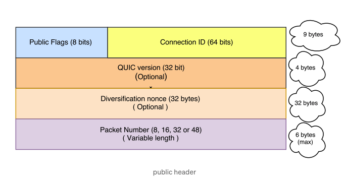

```toc
```

## What is QUIC
QUIC (pronounced “quick”) is a transport layer (TL) protocol developed on top of UDP (User Datagram Protocol). 


<p style="text-align: center;">Figure 1: QUIC in the traditional HTTPS Stack [1].</p>

This paper [1] describes pre-IETF QUIC design and deployment, i.e. gQUIC. Note that IETF has released RFCs for QUIC since May 2021. 

## What were the problems the authors were trying to solve? 

- Web latency remains an impediment to improving user experience
- Tail latency remains a hurdle to scaling the web platform
- Internet is rapidly shifting from insecure to secure traffic, which adds delays. 
- However, efforts to reduce latency in underlying transport mechanisms commonly run into fundamental limitations of TLS/TCP ecosystem. 

### Limitations of (deploying changes in) TLS/TCP ecosystem
1. Protocol Entrenchment
    - Middleboxes have accidentally become key control points in the Internet’s architecture. 
    - E.g. Firewalls tend to block anything unfamiliar for security reasons. NATs rewrite the transport header, making both incapable of allowing traffic from new transports without adding explicit support for them.
    - Middleboxes tend to evolve slower than the edges. 
    - Modifying TCP remains challenging due to its ossification by middleboxes. Simple protocol changes are now expected to take upwards of a decade to see significant deployment.
2. Implementation Entrenchment
   - There is a need to deploy changes to client rapidly for security reasons. However TCP is commonly implemented in OS kernel. 
   - OS upgrades have system-wide impact and the upgrade pipelines and mechanisms are appropriately cautious.
   - Limits the deployment and iteration velocity of even simple networking changes.
3. Handshake Delay
   - Layering helps with modularity but adds on latency: TCP + TLS handshakes
   - Most connections on the Internet, and certainly most transactions on the web, are short transfers and are most impacted by unnecessary handshake round trips.
4. Head-of-line (HOL) Blocking Delay
   - HTTP2 solves the HOL blocking for HTTP requests (See Figure 2). However, TCP HOL blocking remains. 
   - Unlike UDP, TCP ensures the delivery of data reliably, the order of delivery. However, with multiplexing in HTTP2, different data that do not need to be ordered can be sent using the same TCP connections. However, due to TCP bytestream abstraction, these data cannot be told apart and HOL blocking occurs unnecessarily. 


<p style="text-align: center;">Figure 2: HTTP 1.1 vs HTTP 2 [2].</p>


## Big Picture: gQUIC Design and Implementation

QUIC is designed to meet several goals: deployability, security and reduction in handshake and HOL blocking delays. 

### Connection Establishment

QUIC relies on a combined cryptographic and transport handshake for setting up a secure transport connection. 
- On a successful handshake, a client caches information about the origin. 
- On subsequent connections to the same origin, the client can establish an encrypted connection with no additional round trips. 
- Proactive sending (See Encypted request in Figure 3): Data can be sent immediately following the client handshake packet with- out waiting for a reply from the server


<p style="text-align: center;">Figure 3: Timeline of QUIC’s initial 1-RTT handshake, a subsequent successful 0-RTT handshake, and a failed 0-RTT handshake. [1].</p>

#### QUIC Cryptography provides 2 levels of secrecy: 
1. Initial client data (before SHLO) is encrypted using initial keys (Client ephemeral Diffie-Hellman (DH) private key and server long term DH public key). 
   - Analogous to TLS session resumption with session tickets. 
2. After SHLO, all client and server data are encrypted using forward-secure keys (both server and client DH keys are ephemeral and offer greater protection). 

#### Version Negotiation
QUIC clients and servers perform version negotiation during connection establishment to avoid unnecessary delays. 
- A QUIC client proposes a version to use for the connection in the first packet of the connection and encodes the rest of the handshake using the proposed version.
- If the server does not speak the client-chosen version, it forces version negotiation by sending back a Version Negotiation packet to the client carrying all of the server’s supported versions, causing a round trip of delay before connection establishment.

### Stream Multiplexing

QUIC supports multiple streams within a connection, ensuring that a lost UDP packet only impacts those streams whose data was carried in that packet. 
- This avoids TCP HOL blocking problem. UDP doesn't face HOL blocking because UDP follows the “fire and forget” approach, where no guarantee or care is given if the data is received at the other end. 

Streams can be used for framing application messages of arbitrary size—up to $$2^{64}$$ bytes can be transferred on a single stream—but they are lightweight enough that when sending a series of small messages a new stream can reasonably be used for each one. 

If either the sender or the receiver determines that the data on a stream is no longer needed, then the stream can be canceled without having to tear down the entire QUIC connection.

### Authentication and Encryption 

With the exception of a few early handshake packets and reset packets (public header included), QUIC packets are fully authenticated and mostly encrypted. 


<p style="text-align: center;">Figure 4: QUIC Public Header - Authenticated but not encrypted [4].</p>

1. Connection ID: Serves as routing and identification purpose. 
   - Used by load balancers to direct traffic to right server (with state) 
   - See more in NAT Rebinding and Connection Migration Section 
2. Diversification Nonce 
   - Server generates and sends to client in SHLO to add entropy into key generation. 
3. Packet number is used by both endpoints as a per-packet nonce for authentication and decryption. 

Note that any information sent in unencrypted handshake packets, such as in the Version Negotiation packet, is included in the derivation of the final connection keys.
- In-network tampering of these handshake packets causes the final connection keys to be different at the peers, causing the connection to eventually fail without successful decryption.


### Loss Recovery 

TCP sequence number serves 2 different roles: i) For reliability (retransmission) and ii) represents order in which bytes are to be delivered at receiver. 

- This conflation leads to TCP retransmission ambiguity which occurs since a retransmitted TCP segment carries the same sequence numbers as the original packet. 
- The receiver of TCP ACK cannot determine whether the ACK was sent for the original transmission or for a retransmission. 

1. (For reliability) Each QUIC packet carries a new monotonically increasing packet number, including those carrying retransmitted data.
- Avoid TCP retransmission ambiguity. 

2. (For orders within streams) Stream offsets in stream frames are used for delivery ordering. 

3. Additionally QUIC acknowledgments explicitly encode the delay between the receipt of a packet and its acknowledgment being sent. 
- Allows for precise network RTT estimate, and aid in loss detection. --> Also aid rate-based cc like BBR and PCC. 

### Flow Control 

QUIC employs a few tiers of flow controls top limit buffer that sender/single stream can consume: 

1. Connection-level flow control 
2. Stream-level flow control 
3. (Similar to HTTP/2) credit-based flow-control
   - A QUIC receiver advertises the absolute byte offset within each stream up to which the receiver is willing to receive data. 
   - Receiver periodically sends window update frames that increase the advertised offset limit for that stream


### Congestion Control 

QUIC does not rely on a specific congestion control algorithm and our implementation has a pluggable interface to al- low experimentation. 

### NAT Rebinding and Connection Migration

QUIC connections are identified by a 64-bit Connection ID. Connection ID enables connections to survive changes to the client’s IP and port. 
- Such changes can be caused by NAT timeout and rebinding (which tend to be more aggressive for UDP than for TCP) or by the client changing network connectivity to a new IP address.

### QUIC Discovery for HTTPS 

A client does not know a priori whether a given server speaks QUIC.

- By default, client sends request over TLS/TCP. 

- Servers then advertise QUIC support by including an Alt-Svc header in their HTTP response. 

- On a subsequent HTTP request to the same origin, the client races a QUIC and a TLS/TCP connection, but prefers the QUIC connection by delaying connecting via TLS/TCP by up to 300 ms.

- Whichever protocol successfully establishes a connection first ends up getting used for that request.

## Performance 

### Handshake Latency

Handshake latency is the amount of time taken to establish a secure transport connection. In TLS/TCP, this includes the time for both the TCP and TLS handshakes to complete. 


<p style="text-align: center;">Figure 5: Comparison of handshake latency for QUIC and TCP versus the minimum RTT of the connection [1].</p>

With increasing RTT, average handshake latency for TCP/TLS trends upwards linearly, while QUIC stays almost flat. QUIC’s hand- shake latency is largely insensitive to RTT due to the fixed (zero) latency cost of 0-RTT handshakes, which constitute about 88% of all QUIC handshakes.

## Performance Limitations

QUIC’s performance can be limited in certain known cases: 

### 1. Pre-warmed connections 
When applications hide handshake latency by performing handshakes proactively, these applications receive no measurable benefit from QUIC’s 0-RTT handshake.

### 2. High bandwidth, low-delay, low-loss networks
Under these conditions, QUIC performance shows little gain and occasionally negative performance impact.

When used over a very high-bandwidth (over 100 Mbps) and/or very low RTT connection (a few milliseconds), QUIC may perform worse than TCP. 
- This limitation is due to client CPU limits and/or client-side scheduler inefficiencies in the OS or application.

### 3. Mobile devices 
QUIC’s gains for mobile users are generally more modest than gains for desktop users.

Mobile applications are often fine-tuned for their environment. For example, when applications limit content for small mobile-screens, transport optimizations have less impact. 

Mobile phones are also more CPU-constrained than desktop devices, causing CPU to be the bottleneck when net- work bandwidth is plentiful.

## References
[1] A. Langley et al. (2017). The QUIC Transport Protocol: Design and Internet-Scale Deployment. 

[2] https://blog.cloudflare.com/the-road-to-quic/

[3] https://anuradhawick.medium.com/the-quic-internet-its-the-future-d903440b26ea 

[4] https://nirosh.medium.com/understanding-quic-wire-protocol-d0ff97644de7

