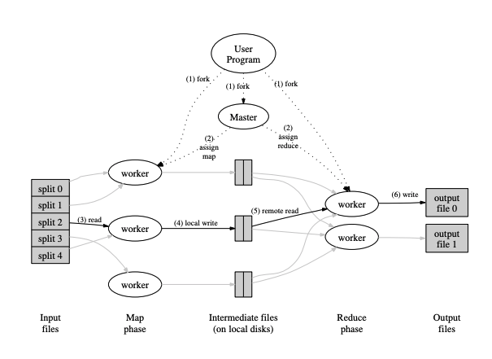

```toc
# This code block gets replaced with the TOC
```

## What is MapReduce? 

MapReduce is an interface that enables automatic parallelization and distribution of <strong>large-scale computation</strong>, while <strong>abstracting over "the messy details of parallelization, fault-tolerance, data distribution and load balancing"</strong> [1].

As the name suggests, MapReduce is inspired by <em>map</em> and <em>reduce</em> functions present in many functional languages, which allows them to parallelize large computation easily and use re-execution as a key mechanism to deal with failures.

<!-- > Users specify a map function that processes a
key/value pair to generate a set of intermediate key/value
pairs, and a reduce function that merges all intermediate
values associated with the same intermediate key -->

### What were the problems MapReduce was trying to solve? 

Before MapReduce, Google has implemented hundreds of computations that process a large amount of raw data to compute various derived data. 

They found that most of these computations were conceptually straightforward. However, the difficulty comes in the form of large input data whose computation has to be distributed across up to thousands of machines to complete in a reasonable time. Some of these issues that arise with distributed computation are:

1. How to parallelize the computation
2. How to distribute the large input/output data
3. How to handle failures

The main goal of MapReduce is hence to provide an easy-to-us interface even for programmers without experience in distributed and parallel systems by abstracting all the details of parallelization, fault-tolerance, data distribution, and load balancing away. 

A benefit that comes with the main goal is that it becomes easier to improve the performance of a computation process by simply adding new machines to the cluster because MapReduce automatically handles all the abstractions for programmers. 

### The big picture of MapReduce (Architecture)

We can express a computation using MapReduce in the form of 2 user-defined functions: Map and Reduce. 

map $:= (k1, v1)$ --> $list(k2, v2)$

reduce $:= (k2, list(v2))$ --> $list(v3)$

<em>Map</em>:  Takes a data input (key, value) pair and produces a set of intermediate (key, value) pairs. The MapReduce library groups together all intermediate values associated with the same intermediate key I and passes them to the Reduce function.

<em>Reduce</em>: Accepts an intermediate key and a set of values for that key. It merges these values to form a possibly smaller set of values. Note that the intermediate values are supplied to the reduce function via an iterator. This allows us to handle lists of values that are too large to fit in memory.


Note that in practical use cases, the output from the Reduce operations is often fed as input into another MapReduce job, or possibly another distributed application.  


<p style="text-align: center;">Figure 1: High level overview of an execution of a MapReduce job. Adapted from [1].</p>

Note that the input data is partitioned into a set of $M$ splits. These splits can then be processed in parallel by different machines. The Reduce invocations are also partitioned by the intermediate key space into $R$ splits using a user-defined partitioning function. Both $M$ and $R$ are specified by the user. 

Figure 1 shows the overall flow of a MapReduce job. The following sequence of actions will occur when a user calls a MapReduce function (the numbered labels in Figure 1 correspond to the numbers in the list below): 

1. Input files are split into $M$ pieces typically 16-64MB (Google uses GPS to partition input data automatically) by the user program. It then starts up many copies of the program on a cluster of machines.

2.  One of the copies of the program is special – the master. The rest are workers that are assigned work by the master. There are M map tasks and R reduce tasks to assign. The master picks idle workers and assigns each one a map task or a reduce task.
    - Note that in 2004, network bandwidth is a huge bottleneck and the authors wanted to minimise passing data through the network. As described in the Section of Locality Optimisation, the Master tends to schedule map jobs to machines containing the input data (thus, the map jobs are usually run locally). 

3. A worker who is assigned a map task reads the contents of the corresponding input split. It parses key/value pairs out of the input data and passes each pair to the user-defined Map function. The intermediate key/value pairs produced by the Map function are buffered in the memory of the map worker.


4.  Periodically, the buffered pairs are written to local disk, partitioned into R regions by the partitioning function. The locations of these buffered pairs on the local disk are passed back to the master, who is responsible for forwarding these locations to the reduce workers.
    - Note that reduce jobs only begin after all map jobs are completed (refer to the FAQ Section).

5. When a reduce worker is notified by the master about these locations, it uses remote procedure calls
to read the buffered data from the local disks of the
map workers. When a reduce worker has read all intermediate data, it sorts it by the intermediate keys
so that all occurrences of the same key are grouped
together. The sorting is needed because typically
many different keys map to the same reduce task. If
the amount of intermediate data is too large to fit in
memory, an external sort is used.

6.  The reduce worker iterates over the sorted intermediate data and for each unique intermediate key encountered, it passes the key and the corresponding set of intermediate values to the user’s Reduce function. The output of the Reduce function is appended to a final output file for this reduce partition.
    - a. After all map jobs are completed, reduce worker will pull the intermediate data (from a partition) from the local disk of all map workers.
    - b. Reduce workers will sort the intermediate keys. 
    - c. Pass the intermediate keys in order to Reduce function. 
    - d. Output of Reduce function is appended to a final output file. 

7. When all map tasks and reduce tasks have been completed, the master wakes up the user program. At this point, the MapReduce call in the user program returns back to the user code.

## What are the key lessons from MapReduce? 
1. Restricting the programming model makes it easier to parallelize and distribute computations and to even make such computation fault tolerance. 

    - E.g. For MapReduce, we restrict the model to accept key/value pairs, and the output also is key/value pair. 

2. Redundant executions can be used to reduce the impact of slow machines (stragglers) and to handle machine failures and data loss. 
    - In the event of worker failures, MapReduce master simply re-executes the work done by the unreachable worker and continues to make forward progress. 
    - Refer to Backup Tasks in Section 3.6 [1] on how MapReduce tackles the issue of "straggler": a machine that takes an unusually long time to complete one of the last few map or reduce tasks, thus prolong the total time needed. (tldr: the master schedules backup executions on the remaining in-progress tasks when the MapReduce operation is close to completion)
 

## When is MapReduce not suitable? 

1. When you need real-time processing, MapReduce may not be the fastest option. 

2. It's not always very easy to implement each and everything into a sequence of Map and Reduce function.

3. When your intermediate processes need to talk to each other(MapReduce jobs are run in isolation).

4. When you need to handle streaming data.

5. When you can get the desired result in a local machine. "It's obviously less painful to configure and manage a standalone system as compared to a distributed system." 

## FAQ
> 1. Does the shuffle process in Reduce workers (pulling of intermediate data from all map workers) happen concurrently with reduce operations?

No, it doesn't. The reduce worker will alternate between shuffling data from map workers, and passing the intermediate data to sort and Reduce function. 

> 2. Do the reduce operations occur concurrently with map operations?
No. You can think of the map and reduce operations like occurring in batches. The reduce workers have to wait for all map jobs to be completed to begin working on shuffling, sorting and passing data into Reduce functions. 

This is because MapReduce guarantees ordering, i.e. within a given partition, the intermediate key/value pairs are processed in increasing key order (refer to Section 4.2 of [1]).

In other words, in order for reduce operations to begin, the entire partition must be collected first, then sorted, before the calls to Reduce functions can be made.

The only way to be sure we have the entire partition is to wait for all map operations to be completed so that all input slices have been processed.


## References
[1] Jeffrey Dean and Sanjay Ghemawat (2004). MapReduce: Simplified Data Processing on Large Clusters. https://pdos.csail.mit.edu/6.824/papers/mapreduce.pdf 

[2] Stack Overflow Post https://stackoverflow.com/questions/18585839/what-are-the-disadvantages-of-mapreduce

[3] Class of 2021 NUS DYOM for MIT 6.824 for the FAQ section.