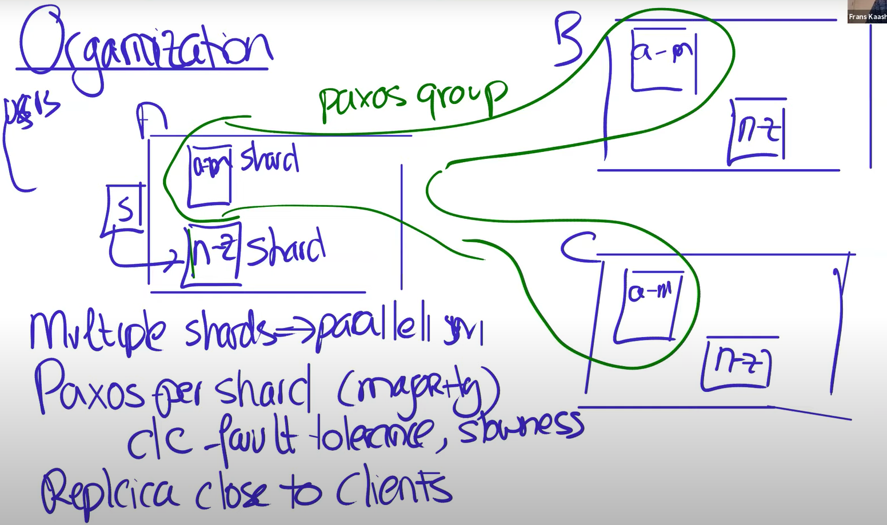
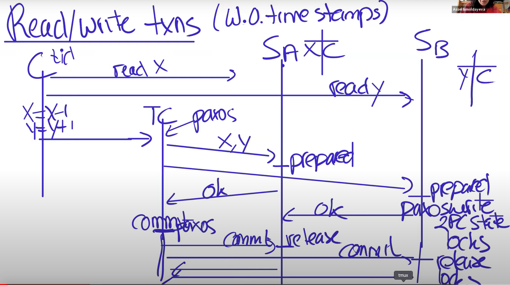
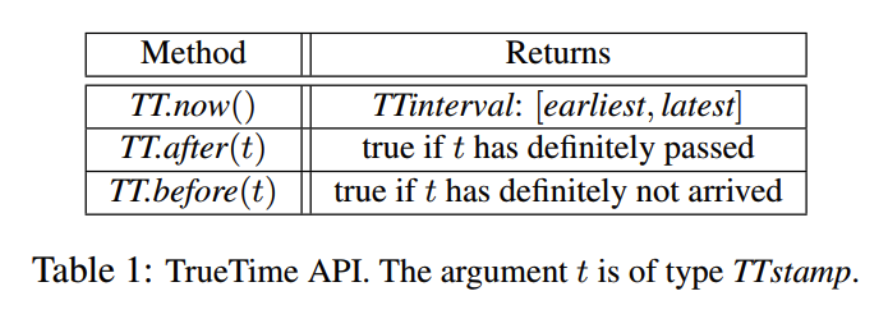

```toc
# This code block gets replaced with the TOC
```

## What is Spanner? 

Spanner is Google's scalable, multi-version, globally distributed and synchronously-replicated database.

### Why should we study about Spanner? 

- Rare example of wide-area distributed transactions, and Spanner showed that this can be practical. 
- Neat ideas used in Spanner's architecture: 
  - Read/write (R/W) transactions: Using [distributed 2 phase commit](https://ocw.mit.edu/resources/res-6-004-principles-of-computer-system-design-an-introduction-spring-2009/online-textbook/) over Paxos + 2 phase locking ==> serializability (2PL) + atomicity (all commit or all abort via 2PC + Paxos)
  -  Read only (R/O) transactions: Snapshot isolation + Synchronized clocks ==> External consistency and Linearizability 
- Widely used within Google

## High-level Overview 

Data is sharded over multiple servers e.g. rows a-m in one server, and rows n-z in another server. Spanner replicates each shard into different datacenter, possibly in different geographical locations. 
- Replication is managed by Paxos; one Paxos group per shard. 
  - Paxos replicates a log of operations 


<p style="text-align: center;">Figure 1: Spanner High Level Overview. Adapted from [3].</p>

### Advantages of this architecture
1. Sharding allows huge total throughput via parallelism.
2. Datacenters fail independently -- different cities.
3. Clients can read local replica -- fast!
4. Can place replicas near relevant customers.
5. Paxos requires only a majority -- tolerate slow/distant replicas.

### Challenges that needs to be solved
1. Read of local replica must yield fresh data. But local replica may not reflect latest Paxos writes!
2. To support transaction across multiple shards and across multiple Paxos groups. --> How to ensure atomicity of transaction?
3. Transactions must be serializable.

Spanner treats read/write and read/only transactions differently.

## Read/Write Transactions
Example read/write transaction (bank transfer):
```
  BEGIN
    x = x + 1
    y = y - 1
  END
```
We don't want any read or write of x or y sneaking between our two ops.
After commit, all reads should see our updates.


### Solution: 2PC + 2PL with Paxos-replicated participants
1. Client picks a unique transaction id (TID).
2. Client sends each read to Paxos leader of relevant shard.
3. Each shard first acquires a lock on the relevant record. May have to wait.
4. Separate lock table per shard, in shard leader.
5. Read locks are not replicated via Paxos, so leader failure -> abort.
    - Note: there will be never be two peers thinking they are leader, because of the leader lease (the disjointness invariant)
6. Client keeps writes private until commit.
7. When client commits:
8. Client chooses a Paxos group to act as 2pc Transaction Coordinator (TC).
9. TC sends writes to relevant shard leaders. Each written shard leader:
    - Acquires lock(s) on the written record(s).
    - Log a "prepare" record via Paxos, to replicate lock and new value.
    - Tell TC it is prepared.
    - Or tell TC "no" if crashed and thus lost lock table.
10. Transaction Coordinator:
    - Decides commit or abort.
    - Logs the decision to its group via Paxos.
    - Tell participant leaders and client the result.
11. Each participant leader:
    - Log the TC's decision via Paxos.
    - Release the transaction's locks.


<p style="text-align: center;">Figure 2: Read/Write Transactions. Adapted from [3].</p>

### Notable points
- Locking (two-phase locking) ensures serializability.
- 2pc widely hated b/c it blocks with locks held if TC fails. Replicating the TC with Paxos solves this problem!
- r/w transactions take a long time because of possibly many inter-datacenter messages. 
- But lots of parallelism: many clients, many shards. So total throughput could be high if busy.

## Read only Transactions

Spanner makes two optimizations to achieve greater performance in read-only transactions:

1. It does not hold locks or use the two-phase commit protocol to serve requests.

2. Clients can issue reads involving multiple shards to the follower replicas of the Paxos groups, not just the leaders. This means that a client can read data from their local replica.

Reads in a read-only transaction only see the values that had been committed before the transaction started, even if a R/W transaction updates those values and commits while the transaction is running.

### Why not read the latest committed values? 
An example from the lecture why this behaviour could violate external consistency: 

```
Suppose we have two bank transfers, and a transaction that reads both.
    T1:  Wx  Wy  C
    T2:                 Wx  Wy  C
    T3:             Rx             Ry
  The results won't match any serial order!
    Not T1, T2, T3.
    Not T1, T3, T2.
  We want T3 to see both of T2's writes, or none.
  We want T3's reads to *all* occur at the *same* point relative to T1/T2.
```

### Solution: Snapshot Isolation
- Synchronize all computers' clocks (to real wall-clock time). --- Need a synchronised clock!!! ([Clocks are generally unreliable in distributed system](https://timilearning.com/posts/ddia/part-two/chapter-8/#unreliable-clocks).)

- Assign every transaction a time-stamp.
    - r/w: commit time.
    - r/o: start time.
  
- Execute as if one-at-a-time in time-stamp order.
    - Even if actual reads occur in different order.
- Each replica stores multiple time-stamped versions of each record.
    - All of a r/w transactions's writes get the same time-stamp.
- An r/o transaction's reads see version as of xaction's time-stamp.
    - The record version with the highest time-stamp less than the xaction's.

## TrueTime API
TrueTime models the uncertainty in clocks by representing time as an interval. Provide the synchronised clock needed in snapshot isolation to preserve external consistency. 


<p style="text-align: center;">Figure 3: TrueTime API. Adapted from [1].</p>


## References
[1] Spanner: Jeffrey Dean et al. (2012). Google's Globally Distributed Database. 

[2] https://pdos.csail.mit.edu/6.824/notes/l-spanner.txt

[3] Lecture 14: Spanner. https://www.youtube.com/watch?v=ZulDvY429B8
