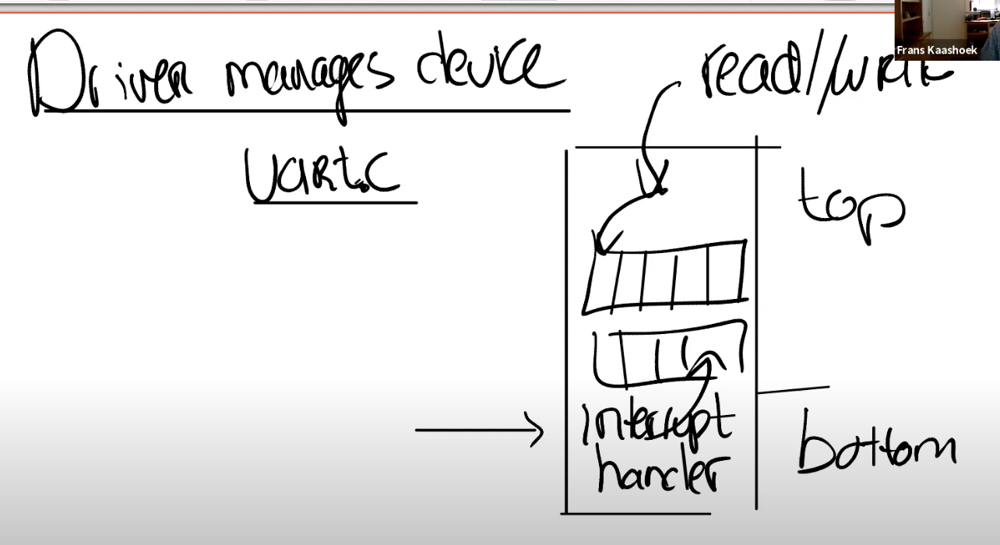

```toc
# This code block gets replaced with the TOC
```

## Key concepts
Interrupts tells the kernel that HW wants attention now. 

Interrupts are a type of traps with new issues/complications:

1. Asynchronous: interrupt running process, and the interrupt handler may be completely unrelated to the current running process (unlike e.g. write syscall where the process causing the trap is operating in similar context of the syscall handler)
2. Concurrency: device and processes run in parallel 
3. Programming devices can be difficult

## Device drivers: top and bottom contexts
Many device drivers execute code in two contexts: 

- Bottom half executes at interrupt time: Interrupt handler. When the CPU has interrupts enabled, the interrupt will fire and the handler will be called, and call the relevant driver in kernel. 

- Top half runs in a process's kernel thread and is called via system calls such as `read` and `write`: Read/write interface where higher level code will calls into 



### Workflow 
1. Code may asks hardware to start an operation (e.g. ask disk to read a block)
2. Code waits for the operation to complete
3. Eventually the device completes and raises an interrupt
4. The driver's interrupt handler (bottom half) figures out which operation has completed, wakes up a waiting process and tells HW to start work on any waiting next operation. 

### Abstraction of device as file 
Unix presents console device as a file -- using file descriptor 0, 1, 2 for console. 

## Concurrency 
Interrupts expose several forms of concurrency:
1. Between device and CPU: producer/consumer parallelism
2. Disable interrupts when code must be atomic 
3. Interrupt may run on different CPU in parallel (different cpu share same buffer -- locks)

### Producer/consumer parallelism
E.g. for printing: shell is producer and device (e.g. monitor) is consumer. To decouple the two we use a buffer in the driver. Note that bottom half and top half may run in parallel on different CPUs. 
1. Top half puts chars into buffer 
2. Bottom half remove chars from buffer

## Polling
Processor spins until device wants attention
- Cons: Wastes processor cycles if device is slow
- Pros: But inexpensive if device is fast because no saving of registers etc. If events are always waiting, no need to keep alerting the software. 

### Polling vs Interrupts
- Polling rather than interrupting, for high-rate devices
- Interrupt for low-rate devices, e.g. keyboard constant polling would waste CPU
- Switch between polling and interrupting automatically: interrupt when rate is low (and polling would waste CPU cycles); poll when rate is high  (and interrupting would waste CPU cycles)
- Faster forwarding of interrupts to user space for page faults and user-handled devices
- Kernel bypass: h/w delivers directly to user, w/o kernel intervention? 
- Faster forwarding path through kernel?


