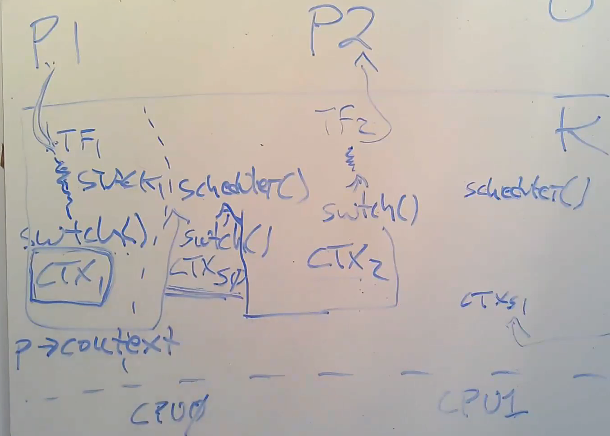

```toc
# This code block gets replaced with the TOC
```

## Key concepts

### Aim: To achieve parallel speedup on multi-core hardware.

Any OS is likely to run with more processes than CPU. 
- We can time-share the CPUs among the processes, especially when one process is waiting on I/O. 
- Use multiplexing by switching each CPU from one process to another!
- Creates the illusion that each process has its own CPU 
  - Just like how memory allocator and virtual memory create the illusion that each process has its own memory. 

**One Solution:** Thread switching!
- Another method for interleaving multiple tasks is event-driven programming (see epoll) 

A thread is a serial execution with its PC, REGS, STACK. 
- Interleaves threads among multiple cores

Threads can share memory, or not:
- xv6 kernel threads: yes (need locks!)
- xv6 user processes: no
- Linux user processes: yes


### Challenges for Thread Design 
1. How to switch from one process to another? 
2. How to make interleaving transparent?
3. What to save when a thread isn't running?
4. How to cope with compute-bound threads? (Pre-emptive vs voluntary interrupts)
5. Scheduling - choosing which thread to run next (xv6 uses round robin)

**States of processes:**
- Running
- Runnable
- Sleeping
- (For termination) Zombie
- Unusable

## xv6 Context Switching
The xv6 scheduler has a dedicated thread (saved registers and stack) per CPU because it is not safe for the scheduler to execute on the old process's kernel stack. 
- Another core may wake the process up and run it and 2 different cores using the same stack can lead to undesirable and unpredictable consequences. 

### Overview of thread switching
> Note: Each process has 2 threads: user thread and kernel thread. 

Switching from one thread to another involves saving the old thread's CPU registers, and restoring the previously-saved registers of the new thread. 
- Stack pointer and PC are saved and restored ==> the CPU will switch stacks and switch what code it is executing. 
- The function `swtch`  performs the saves and restores register sets (called contexts). `swtch` only saves callee-saved registers (preserved across fn calls). Caller-saved registers (not preserved across fn calls) are saved on the stack (if needed) by calling C code.

In the `proc` struct:
1. Trapframe (TF): saves user registers
2. Context (CTX): saves kernel registers
3. `p->kstack`: saves the kernel stack

Refer to Figure 1: consider context switch from process 1 to process 2: 
1. user -> kernel: saves user registers of P1 in TF
2. kernel -> scheduler thread: `swtch()` saves kernel registers into context 
3. scheduler thread -> kernel (of process 2): restore kernel registers from CTX
4. kernel -> user: restore user registers from TF 



<p style="text-align: center;">Figure 1: High Level Workflow of Context Switch.</p>

#### Atomic operations of context switching 

Context switching involves multiple operations specifically: 
1. Changing p->state to RUNNABLE (from RUNNING) 
2. Save kernel registers in context
3. Stop using process's kernel stack (switch to scheduler's stack)

To protect these operations, making it **atomic and uninterruptable**, we use locks (`p->lock`). This is important so that another CPU's scheduler won't start running p until all of the above steps are complete. 

In particular, `p->lock` is held across `swtch` call from process kernel thread, and released only in the scheduler's thread. If `p->lock` is released before `swtch()` is called in the process kernel thread, another core's scheduler could see `p->state` as RUNNABLE and start running it (2 cores running the same process and using the same stack!). 


<p style="text-align: center;">Figure 2: Using lock to ensure atomic operations in context switching.</p>


### Pre-emptive Scheduling
> *Definition: A forced yield of unaware code as opposed to cooperative scheduling.*

xv6 pre-emptively schedules threads via periodic timer interrupts. The kernel grab controls from the thread when the timer interrupts and store states before context switching. 

### Scheduler
There is one scheduler thread per CPU, with its own separate stack and context. 
- xv6 does not support direct kernel thread to kernel thread switches (more complicated because we are running scheduler loop on kernel stack - what happens if less threads than CPU?)
- Scheduler separate thread simplifies cases like switching away from an exiting process
- The scheduler tries to find RUNNABLE thread to run else it is "idle"
- Briefly enables device interrupt in its loop as there may be no RUNNABLE threads (processes may be waiting for I/O and get blocked)

### Locking in context switching
Scheduler `sched()` forbids locks from being held when yielding CPU (other than p->lock) because this may result in deadlock. For example: 

```
P1 holds lock L1, yield CPU. 

P2 runs, tries to acquire L1 but fails. 

If P2 has turned off interrupts, P2 won't yield CPU. 

So P1 can't execute and won't release L1 ever. 
```

## Conclusion 
To recap: 

- Each core is either i) running scheduler thread ii) some other threads / none, but only 1 thread at one time. 

- Each kernel thread is either i) runing on exactly 1 core ii) has its registers saved in context 

## References
[1] https://www.youtube.com/watch?v=vsgrTHY5tkg 

[2] https://pdos.csail.mit.edu/6.S081/2020/lec/l-threads.txt 