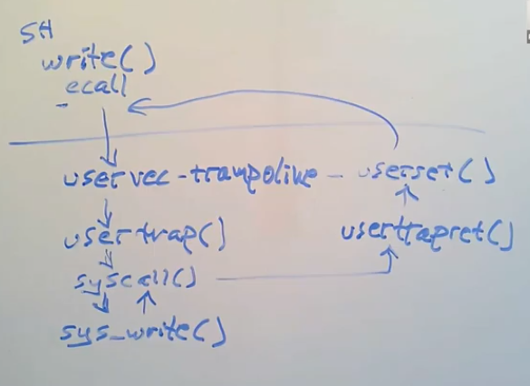

```toc
# This code block gets replaced with the TOC
```

## Key concepts

1. Important to maintain isolation between userspace and kernelspace 
2. Traps include system calls, faults, interrupts
3. Typical workflow: i) Trap forces a transfer of control into the kernel ii) Kernel saves registers and other state so that execution can be resumed iii) kernel executes appropriate trap handler cde iv) kernel restores saved state and returns from trap v) original code resumes where it left off 
4. Traps are transparent to user application (see point v above)

### What does switching mode from user to supervisor allow?

1. Supervisor can use CPU control registers
2. Supervisor can use PTEs that have no PTE_U flag
3. Can't use addresses that aren't the in page table

## Trap Machinery 
Control registers involved: (only can be used in supervisor mode)

1. `stvec`: The kernel writes the address of its trap handler here; the RISC-V jumps here to handle a trap.
2. `sepc`: When a trap occurs, RISC-V saves the program counter here.
3. `scause`: Describes the reason for the trap
4. `sscratch`: The kernel places a value here that comes in handy at the very start of a trap handler. (Trapframe)
5. `sstatus`: SIE bit controls whether device interrupts are enabled

### What needs to be done to deal with traps? 

1. Switch to kernel page table
2. Switch to kernel stack 
3. Save registers, including pc 
4. CPU to switch to a kernel-specified instruction address, namely stvec
5. Jump to C kernel code

### To force a trap, what will RISC-V hardware do? 
1. If the trap is a device interrupt, and the `sstatus` SIE bit is clear, don’t do any of the following.
2. Disable interrupts by clearing SIE.
3. Copy the pc to sepc.
4. Save the current mode (user or supervisor) in the SPP bit in `sstatus`.
5. Set `scause` to reflect the trap’s cause.
6. Set the mode to supervisor.
7. Copy stvec to the pc.
8. Start executing at the new pc.


## Traps from User Space
Overview flow of trap machinery from userspace using shell as example: 



Recall: Hardware will set stvec to point to uservec in trampoline. Currently in supervisor mode. 

- `satp` still points to user page table  --> thus, user page table must have a mapping for uservec (va in stvec --> pa of instruction)
- In order to continue executing instructions after the switch of user page table to kernel page table (performed in uservec), uservec must be mapped at the same address in kernel page table as in the user page table. 

### uservec: (asm)

- swap a0 and sscratch (points to a per-process TRAPFRAME)
- Save user registers in TRAPFRAME
- Restore kernel stack pointer
- Restore cpu hartid
- Restore kernal page table (satp)

### usertrap: (C)
The job of usertrap is to determine the cause of the trap, process it, and return. 

1. Change stvec to point to kernelvec -- so that a trap while in kernel will be handled by kernelvec 
   - Note: There's a window of time when kernel is executing but stvec is set to uservec (not yet switch to kernelvec). RISC-V hardware disable interrupt when it starts to handle a trap, and interrupt is only enable after stvec is set. 
2. Save pc into sepc. The system call path adds 4 to the sepc because  for RISC-V the pc should return to the next instruction (after ecall). 
3. If trap is system call, syscall handles it. If it is a device interrupt, devintr; othersie it is an exception and the kernel kills the process.

### usertrapret (calls userret)

Recall the special property of the Trampoline page (uservec): it is mapped at the same va in both user and kernel page tables. 
- Allows uservec to continue executing even after changing `satp` 

1. Switches `satp` to user page table
2. Save trapframe to `sscratch` 
3. Restore saved registers from trapframe 
4. Use `sret` to return to user space

## Traps from Kernel Space

Recall when kernel is executing on a CPU (see usertrap), stvec points to `kernelvec`. 

1. kernelvec saves the registers on the stack of the interrupted kernel thread. (store stack --> registers)
2. kernelvec calls kerneltrap: deals with device interrupts and exceptions. 
3. After kerneltrap is done, it needs to return to whatever code was interrupted by the trap. --> kerneltrap saves pc, mode and cause of trap. Restores these control registers before returning to kernelvec
4. Kernelvec pops the saved reisters and executes sret. 

## References
[1] xv6: a simple, Unix-like teaching operating system (2020). https://pdos.csail.mit.edu/6.S081/2020/xv6/book-riscv-rev1.pdf